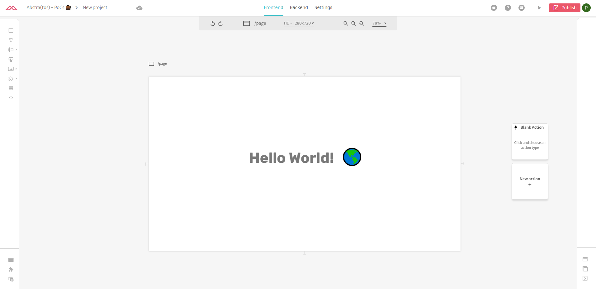
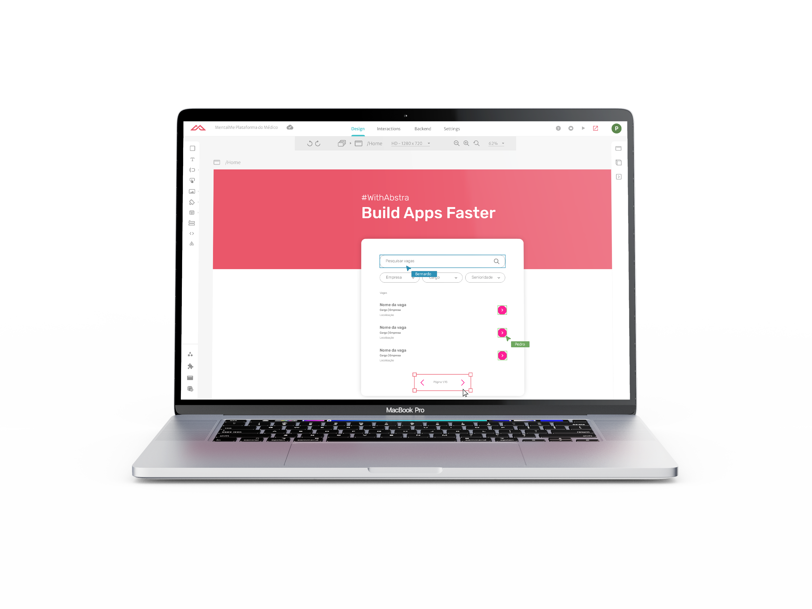

# Introduction to Abstra

### Build apps faster!

Abstra is a tool that allows development teams \(tech or not\) to develop new digital products in a simple and agile way. The users don't need to be experienced developers or have highly technical skills. Just having a little programming notion is enough to build great products!

The platform is an interface editor where you can build the front-end of your application visually and connect it to a diversity of resources, like APIs, databases, etc. You can even use languages that don't necessarily touch web development, like Python, VBA, etc.

### Multiplayer

With Abstra, designers and devs, and even other people, can work together - real-time - to build solutions! While the designer works on the interface, the developer can create the logic and connections to make the project work. Thus, in a matter of hours \(or even minutes\), an extremely lean team can deliver an outstanding project.

### Security by default

The Abstra team is dedicated to securing your project in compliance with rules, regulations and standards using industry best practices.

#### Private Cloud

Your project is built in a safe environment. You can host it with us or export the project to host on your own cloud.

#### Dedicated Database

Every project has its own database instance.

#### Authentication

Every application is secure by default, using OAuth 2.0 authentication protocol.

#### Compliant with data protection laws

Abstra apps are compliant with the CCPA, GDPR, and LGPD practices.

 A big advantage of using Abstra is that once you've completed the initial settings of the project, it's already set up and valid for the entire project. This makes applications much safer and less susceptible to human error.

