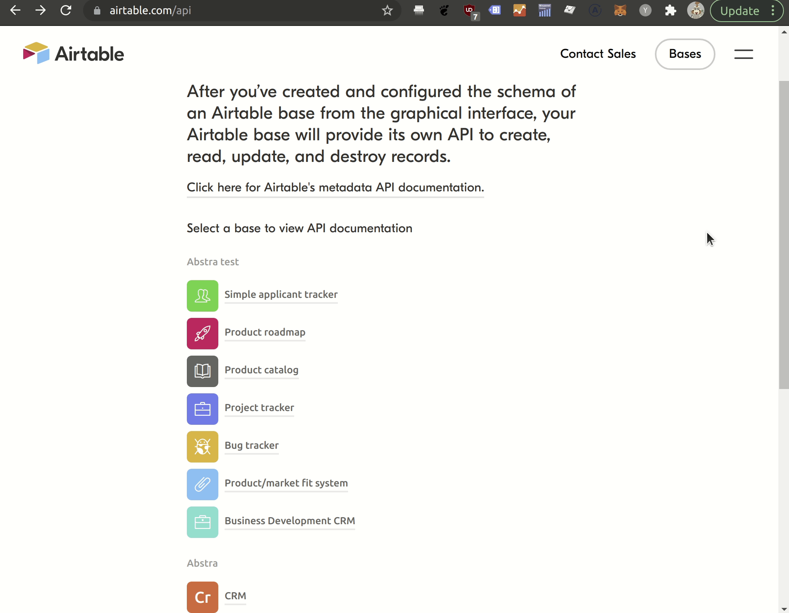
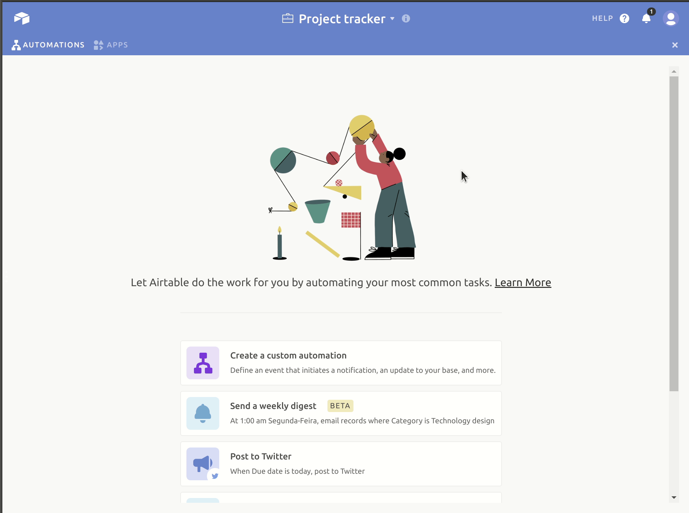
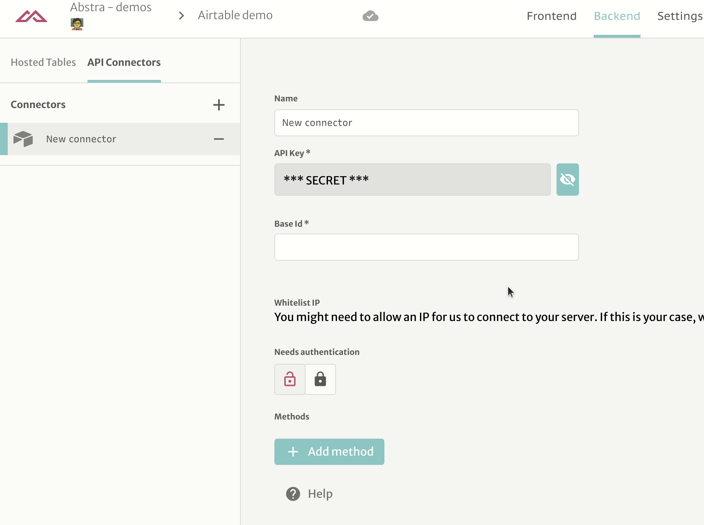
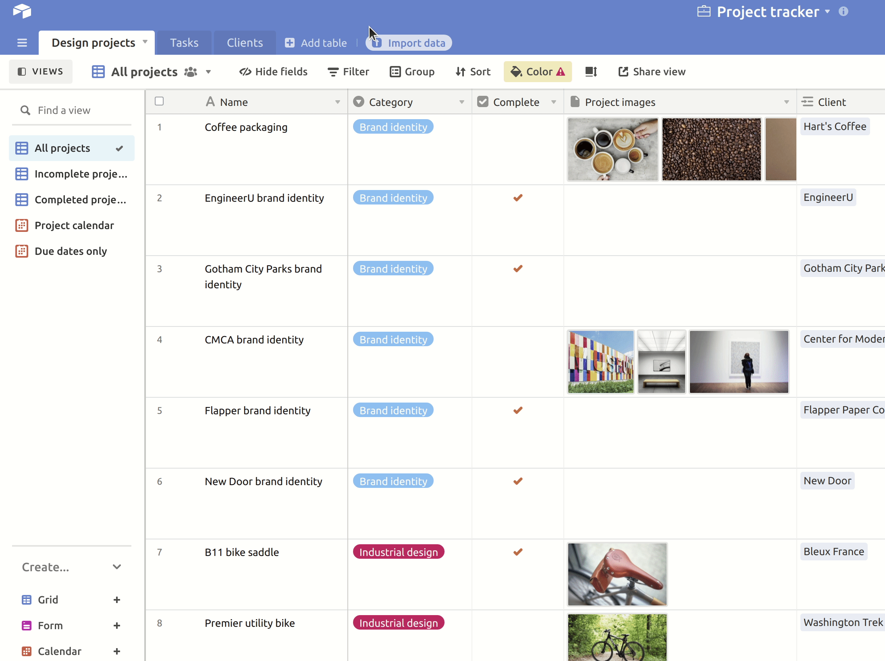
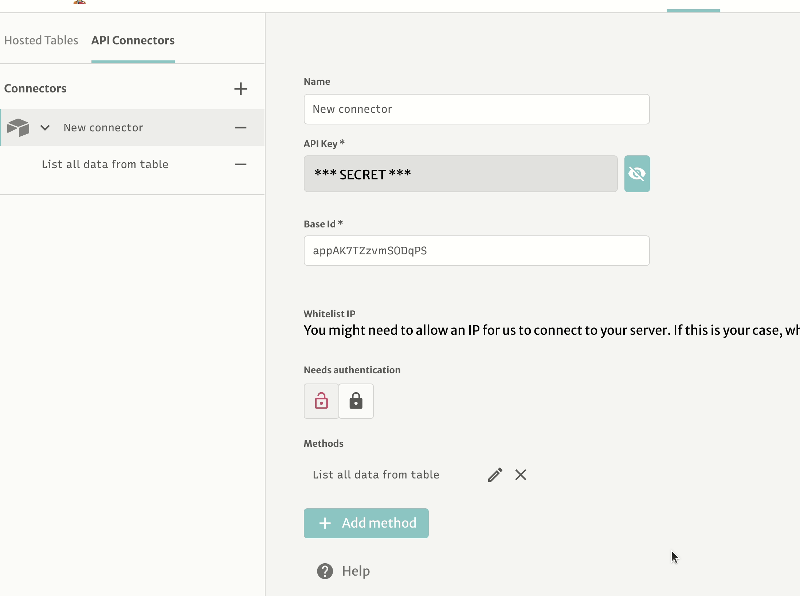
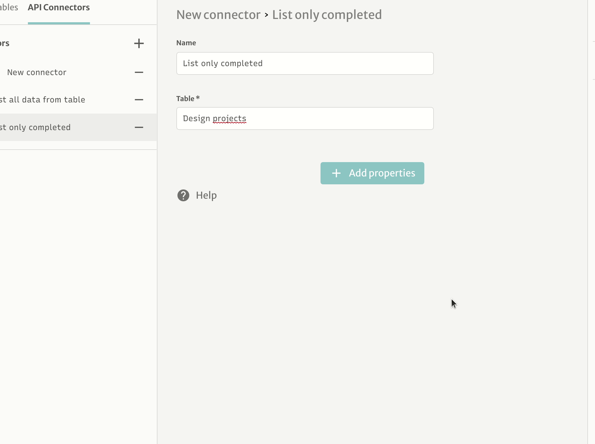
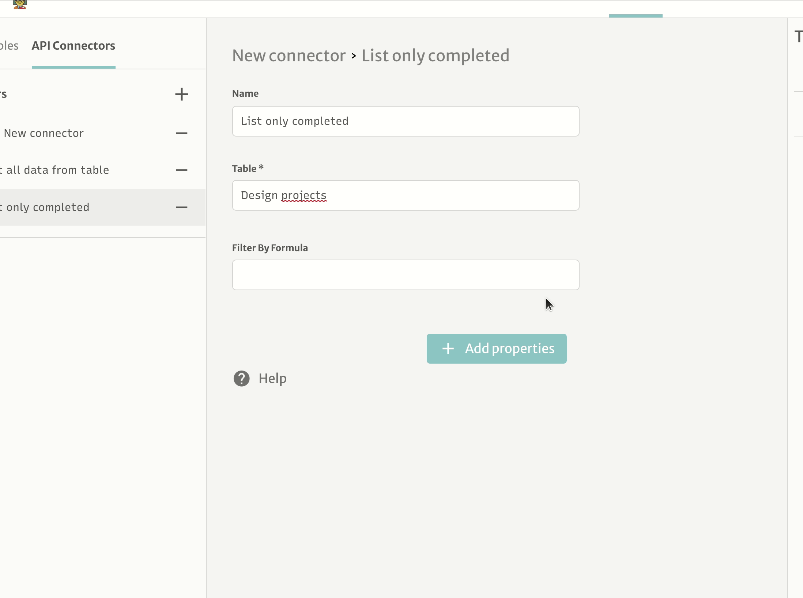
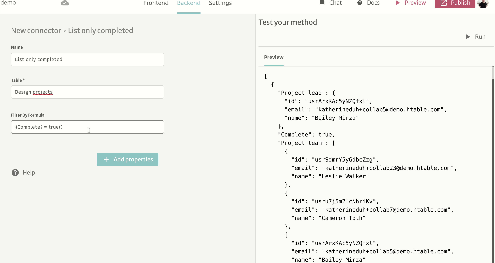

# Airtable

## Connecting to Airtable

In order to get data from Airtable, you should have the following information in hand

* Base ID
* API key

### Getting base ID

Visit [https://airtable.com/api](https://airtable.com/api), then you should see something like this

Select the base you want to connect, then copy the id from URL

### Generating an API key

You can generate API keys on your [account page](https://airtable.com/account).

## Making queries to your base

You can make queries by adding methods.

After that, you can select the table you want to grab the data

Now you can use this connector with Tables, Collections or Actions

## Filtering

Sometimes, you want to filter which elements of Airtable you will want to use. For this, we have a filtering feature.

We will create another method for listing only completed tasks.

Then we will add the filter property to this method

Now we can use [Airtable's formula syntax](https://support.airtable.com/hc/en-us/articles/203255215-Formula-field-reference)

Additionally, you can pass parameters to theses filters.

