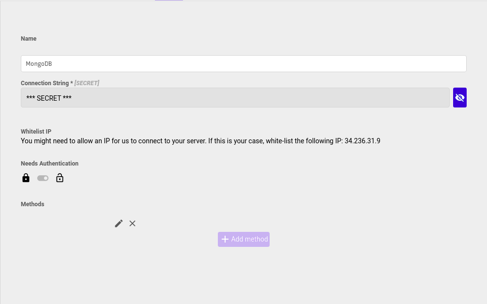

# MongoDB



#### Mongodb Queries

You can write [JSON that represent your Mongo queries](https://docs.mongodb.com/manual/tutorial/query-documents/). You can add **params** to your queries, updates or inserts by adding `$` in front of named keywords that represent textual values or `$$` in front of named keywords that represent numeric values. When you use this query in the frontend, you can can dinamically fill the parameters. Examples

#### Searching for items with qty greater than `$$minQty`:

```text
{
  "qty": {
    "$gt": $$minQty
  }
}
```

#### Updating an item and setting its name to `$name`:

```text
{
  "$set": {
    "name": $name
  }
}
```

#### Inserting an item with values `$name` and `$$qty`:

```text
{
  "name": $name,
  "qty": $$qty
}
```

