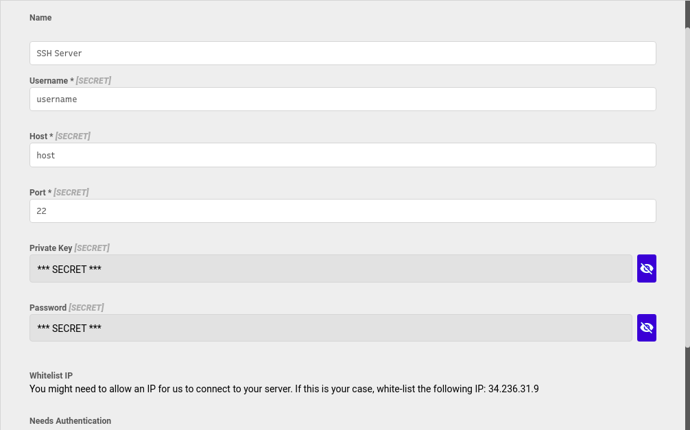

# SSH Server




#### SSH Commands

You can write regular shell commands here, for example:

```text
python cli.py 'Abstra'
```

#### Passing parameters to the command

You can add **params** to your command by adding **:** in front of named keywords. When you use this query in the frontend, you can can dinamically fill the parameters:

```text
python cli.py :param1
```

Or:

```text
echo :text > text.txt
```

