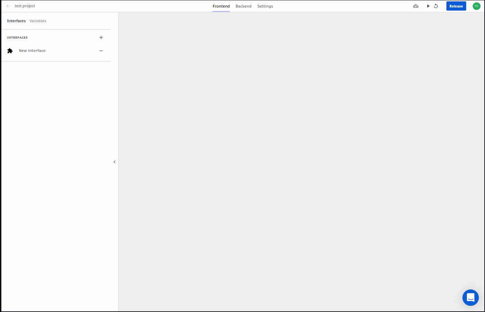

# Slots and Cuts

Abstra takes a different approach in editing an interface:  **Slots** and **Cuts**.   
You start with a resizable slot and then cut it as you wish to make your design.

### Cuts

You can cut a selected slot horizontally and vertically with the top-left menu or via right click or the `h` and `v` shortcuts.  
Cutting a slot divides it in half and persists the background properties on the new slot.

