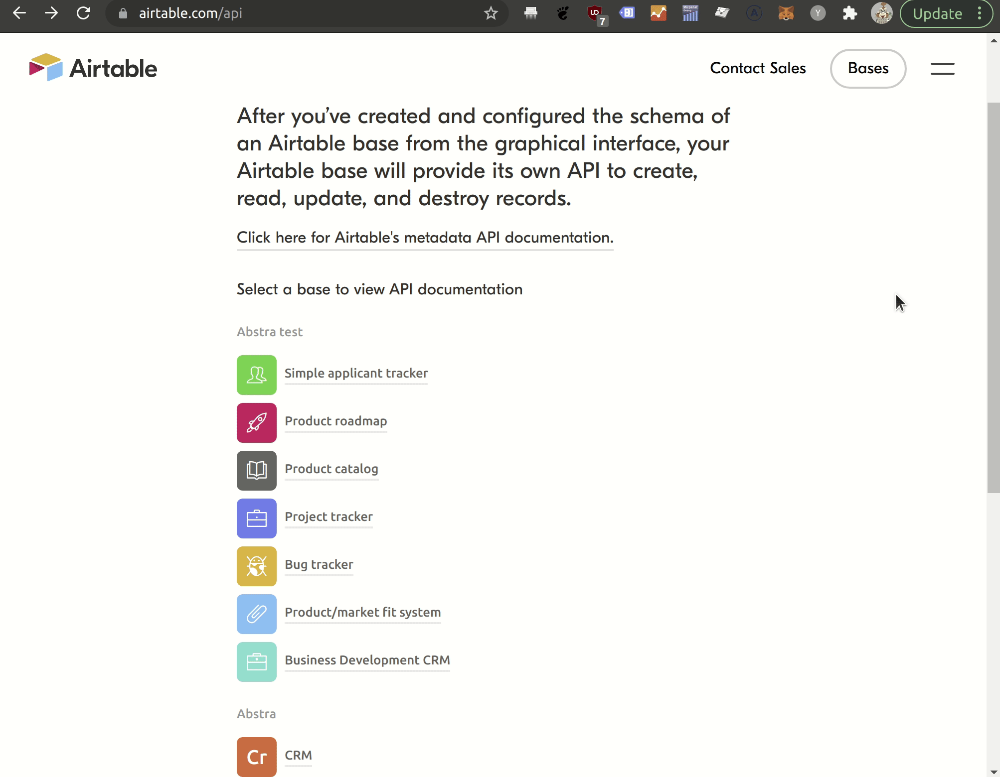
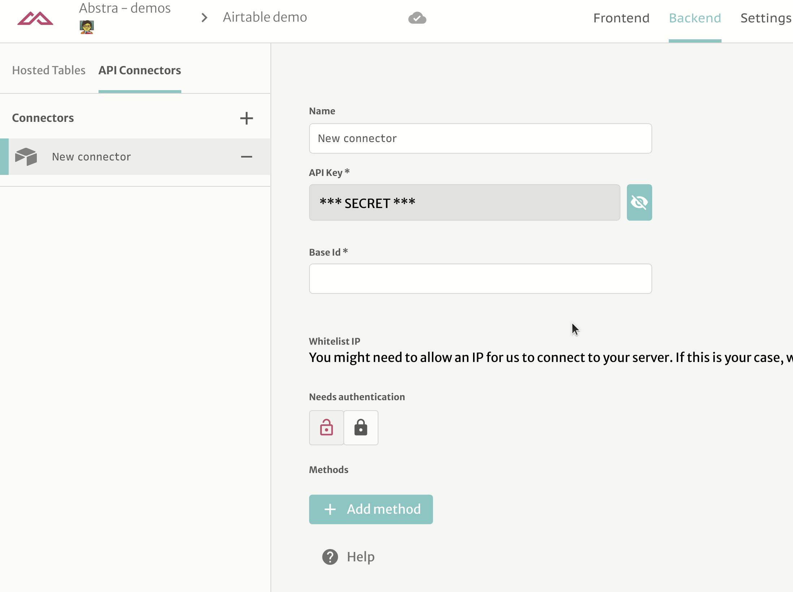
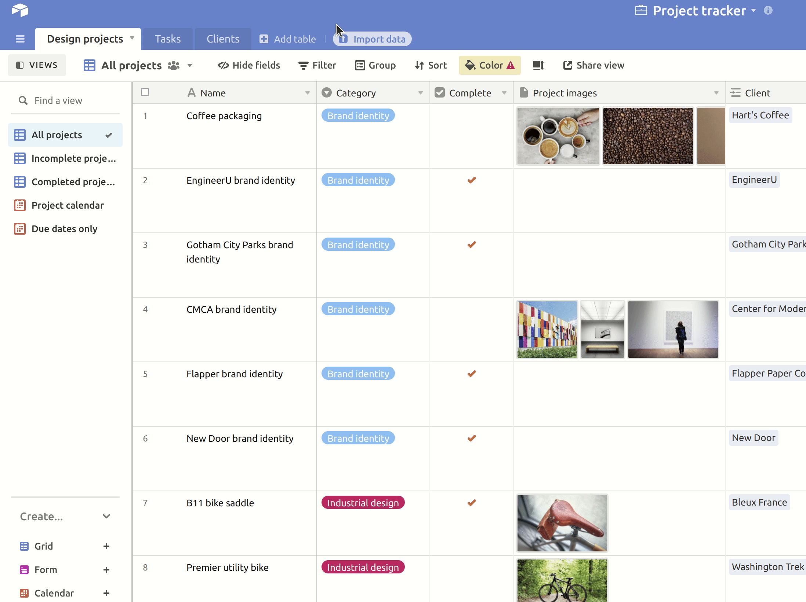
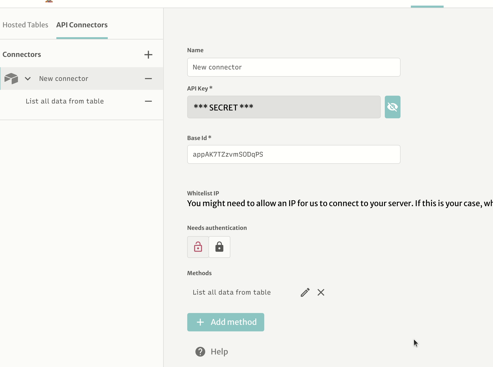
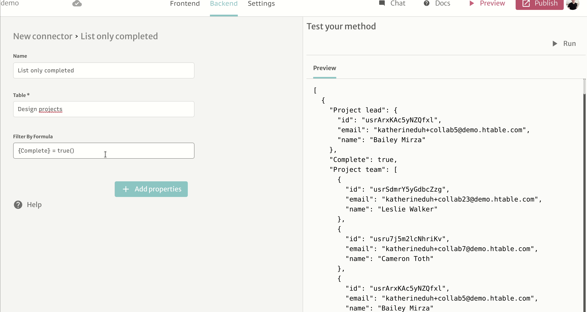
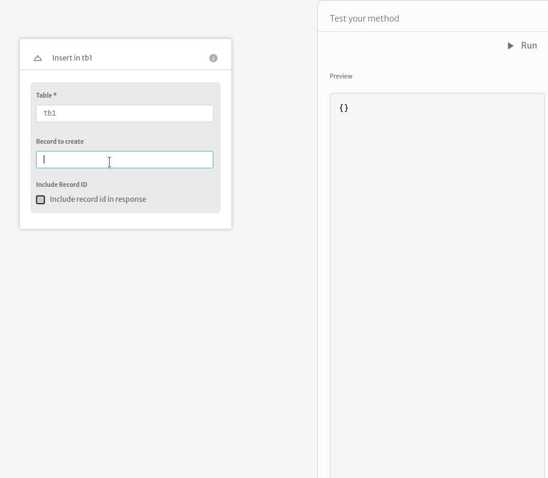

# Airtable

## Connecting to Airtable

In order to get data from Airtable, you should have the following information in hand

* Base ID
* API key

### Getting base ID

Visit [https://airtable.com/api](https://airtable.com/api), then you should see something like this

.png>)

Select the base you want to connect, then copy the id from URL

.png>)

### Generating an API key

You can generate API keys on your [account page](https://airtable.com/account).

## Making queries to your base

You can make queries by adding methods.

### List Records

After that, you can select the table you want to grab the data

Now you can use this connector with Tables, Collections or Actions

#### Filtering

Sometimes, you want to filter which elements of Airtable you will want to use. For this, we have a filtering feature.

We will create another method for listing only completed tasks.

Then we will add the filter property to this method

Now we can use [Airtable's formula syntax](https://support.airtable.com/hc/en-us/articles/203255215-Formula-field-reference)

Additionally, you can pass parameters to theses filters.

#### Additional properties

Other properties you can define are:

* **Maximum number of records**. Specify this to limit the number of records returned
* **List of fields to return**: Specify which fields you want to query.
* **List of fields to sort**: Specify fields and directions to order your query.
* **Include Record ID**: A boolean value to decide if the record id should be included in the result fields

### Create One Record

Here you can create one record on a table. There are 3 possible arguments:

* **table**: Name of the table from where you will be fetching data from. Same as in the **list records** method.
* **fields**: A JSON template (it supports named params like _$params_) to insert in the database
* (optional) **include Record Id**: A boolean value to decide if the record id should be included in the result fields.

### Update Record

Here you can create one record on a table. There are 3 possible arguments:

* **table**: Name of the table from where you will be fetching data from. Same as in the **list records** method.
* **fields**: A JSON template (it supports named params like _$params_) to insert in the database
* (optional) **include Record Id**: A boolean value to decide if the record id should be included in the result fields.

During the use of this method the ID parameter will be prompted. This parameter is required by AirTable to update the specific record. In order to use this the user must have requested (or saved) the ID in a prior action. To get this ID you must toggle on the _includeRecordId_ parameter in the method that retrieves the record data.

