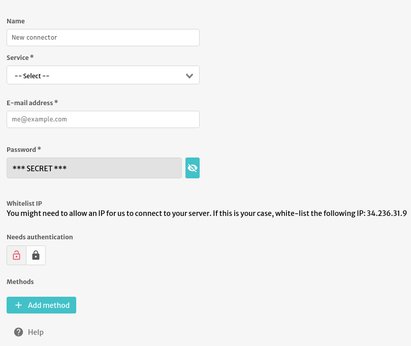

# E-mail

With this connector, you can send e-mails. To configure it, simply fill with your _service_, _email_ and _password_.

Some providers, such as Google’s Gmail, require you to enable _less secure_ apps which authenticate with plain text password. See [**Using Gmail**](https://nodemailer.com/usage/using-gmail/) for more information.



You can use the `+ Add method` to setup a new e-mail to be sent.

### Plain Text

.png>)

With this method you can send plain text e-mails. When creating the template you need to fill at least the subject and body of the e-mail.

You can add **parameters** to your subject and body by adding `$` in front of named keywords. When you use this method in the front-end, you can can dynamically fill the parameters. For example, sending e-mail like:

```
Hello $name.

Today we sold $number units of $product.

Att,

$signature
```

Will ask you to fill `$name`, `$number`, `$product` and `$signature` dynamically.

You can specify **To**, **Cc** or **Bcc** fields. By default only the **To** field is added but the others can be added with add properties.

When you use this method you can dynamically fill additional e-mail addresses (To, Cc, Bcc).

You can fill it by passing a comma separated list of emails such as:

```
me@example.com,admin@abstra.app,test@example.com
```

\
