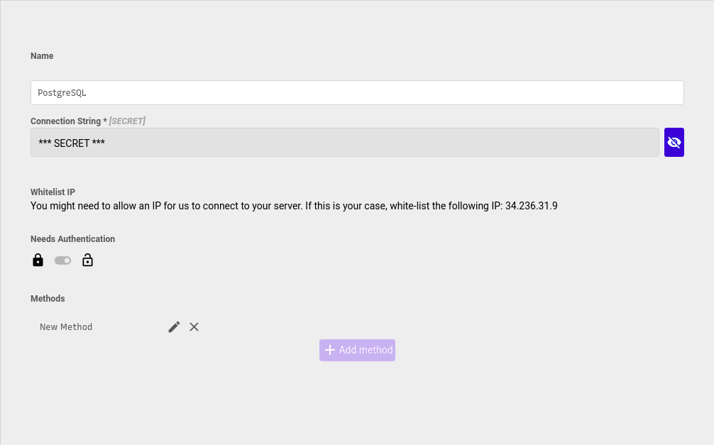

# PostgreSQL




You can write regular [PostgreSQL queries](https://www.postgresql.org/docs/9.4/queries.html) here, for example:

```text
SELECT * FROM "Users" u WHERE u.name LIKE '%John%'
```

## Passing parameters to the query

You can add **params** to your query by naming them **$1**, **$2**, **$3**, ... When you use this query in the frontend, you can dinamically fill the parameters:

```text
SELECT * FROM "Users" u WHERE u.name = $1
```

Insert example:

```text
INSERT INTO "Users"(name, email) VALUES ($1,$2)
```

Update example:

```text
UPDATE "Users" SET name = $1 WHERE u.email = $2
```

Delete example:

```text
DELETE FROM "Users" WHERE u.email = $1
```

