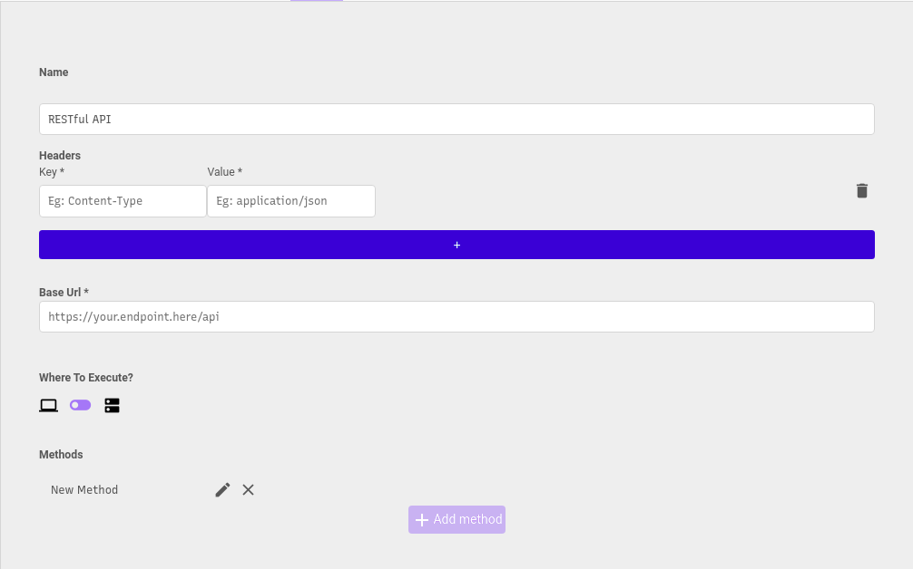

# REST APIs




## Route Params

You can add **route params** with **":"** before the param:

```text
/myroute/:myRouteParam
```

## Query Params

You can add **query params** with **"?"** and **"&"** before the param:

```text
/myroute?firstParam&secondParam&thirdParam
```

## Usage

When using this api in the frontend with **Call Remote Connector action** or inside a **Collection**, you will be able to fill out these params.

