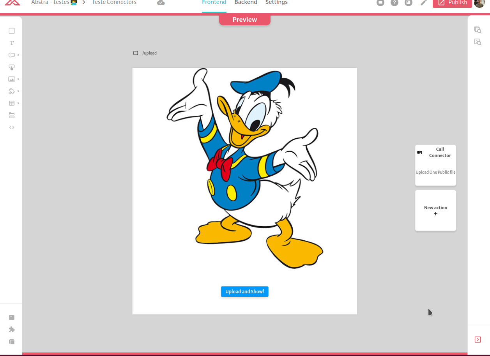

# Storage

With this connector, you can upload, list and download files from your Storage Provider.


Currently we only support _AWS S3_


 To configure it, simply select the provider and fill the credentials of your provider:

#### AWS S3

* _Bucket_
* _AWS region_
* _Access Key Id_
* _Secret Access Key_


There are 2 available methods: Upload and List

In order for our connector to work you need to configure your S3 Bucket CORS as follows:

```javascript
[
    {
        "AllowedHeaders": [
            "*"
        ],
        "AllowedMethods": [
            "PUT",
            "GET"
        ],
        "AllowedOrigins": [
            "*"
        ],
        "ExposeHeaders": []
    }
]
```

This CORS setting enables uploading and downloading files from your bucket.

There are 3 available methods: Upload, List and Download

### Upload

You can specify the `type` and `amount` of the uploaded files. Also a prefix to to prepend to the file name to create or use folders. Abstra also adds an unique hash before the file name to differentiate between files with identical name and fixes it to be URL friendly, so if you upload a picture called `awesome cat.png` its actual uploaded name will be something like `9217e761-957d-43d9-9d5d-5f27b6ac805c-awesome-cat-png`

After the file/files are uploaded the connector response will be the following:

For a single file the response will be:

```text
{
    url: [URL OF THE OBJECT],
    filename: [NAME OF THE UPLOADED OBJECT]
}
```

For multiple file the response will be a list of the response of a single file



### List

This method lists files from your Storage provider. You can filter files by a prefix. The result will be an array of:

```text
{
    Key: [KEY OF THE OBJECT],
    LastModified: [LAST MODIFIED DATE],
    Size: [SIZE OF THE OBJECT],
    url: [URL OF THE OBJECT]
}
```

