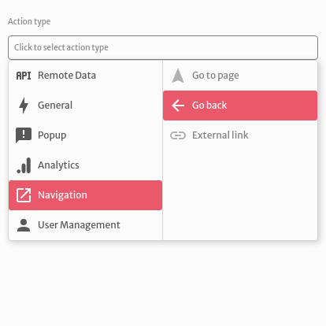
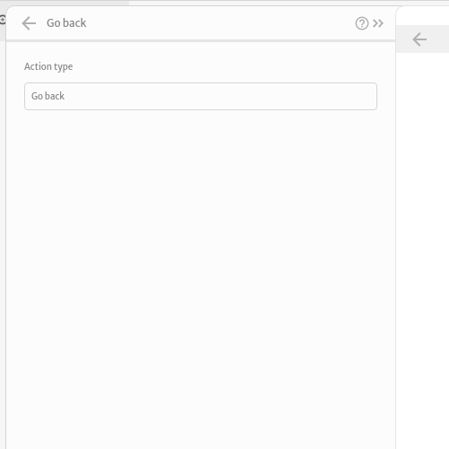
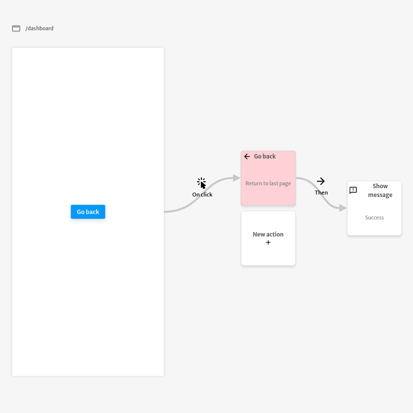

# Go back

The `Go back` action is used to redirect the user of your application to the last page visited by the user.

You don't need to configure any argument for this action.

The example below redirects the user to the previously accessed page after clicking the `Go back` button. After the redirect, it displays the `Success` message.

