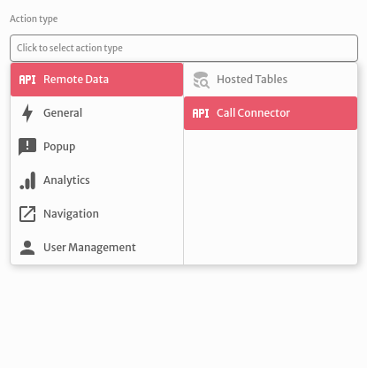
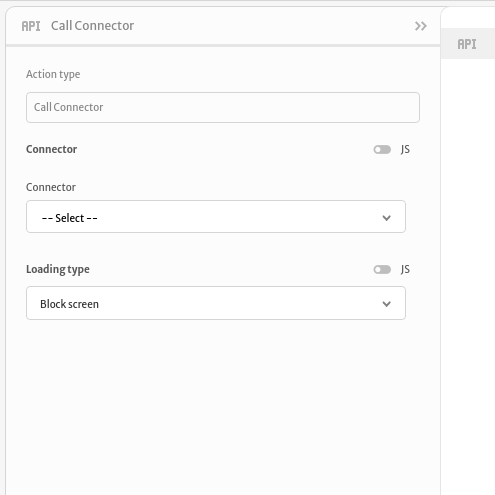
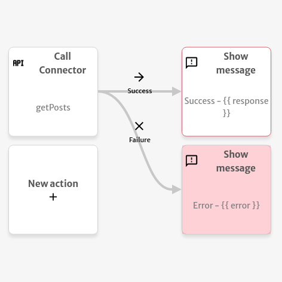

# Call Connector

The `Call Connector` action is used to dispatch one `method` defined at the `API Connectors` division of Abstra's `Backend` section.

First you choose a `Connector` then you can choose a `Method` to be executed and a `Loading type` that can give no feedback to the users of your app or block them from doing anything until the method finishes executing. If your method has parameters defined you can pass values directly or through variables.

After the query execution a `response` and an `error` variables will be exposed and can be used to do operations with other actions. The example below displays the message `Success` with the `response` in case of a successful execution and the message `Error` with the `error` in case of a failed execution of the `getPosts` method. 

