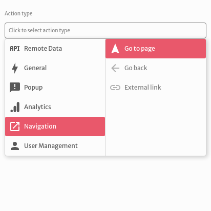
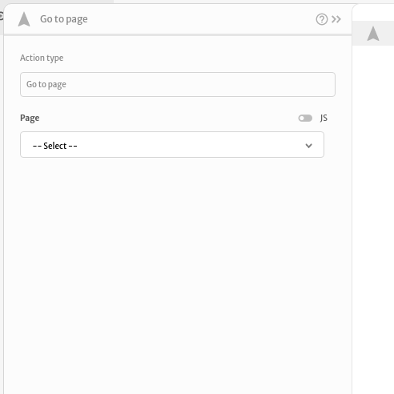
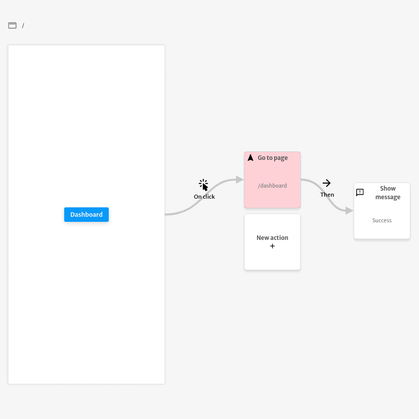

# Go to page

The `Go to page` action is used to redirect the user of your application to another page.

You can choose an existing `Page` of your app to redirect your user to.

The example below redirects the user to the `/dashboard` page after clicking the `Dashboard` button. After the redirect, it displays the `Success` message.

