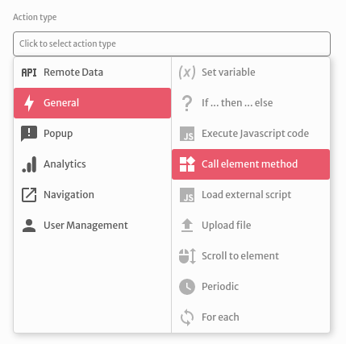
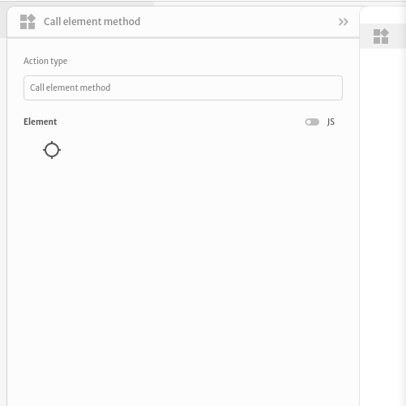
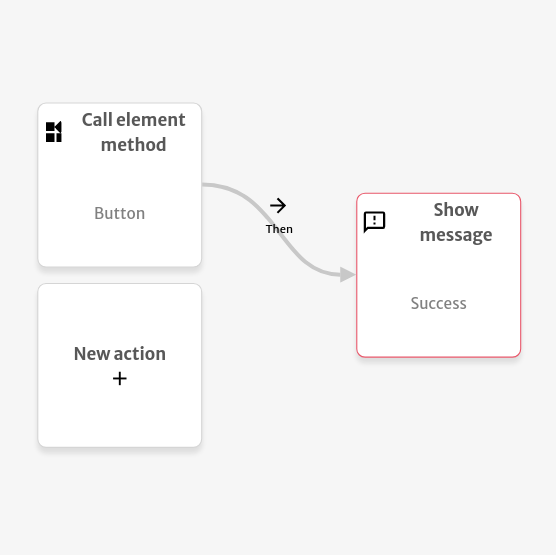

# Call Element Method

The `Call element method` action is used to fire a method from an [element](../elements/) on the screen.

You are able to select which element and method you wish to call. Reference: [componentMethod](https://docs.abstra.app/docs/projects/front-end/arguments/argument-types#componentmethod)

The example below shows the message `Success` after correctly calling the Button element method.

