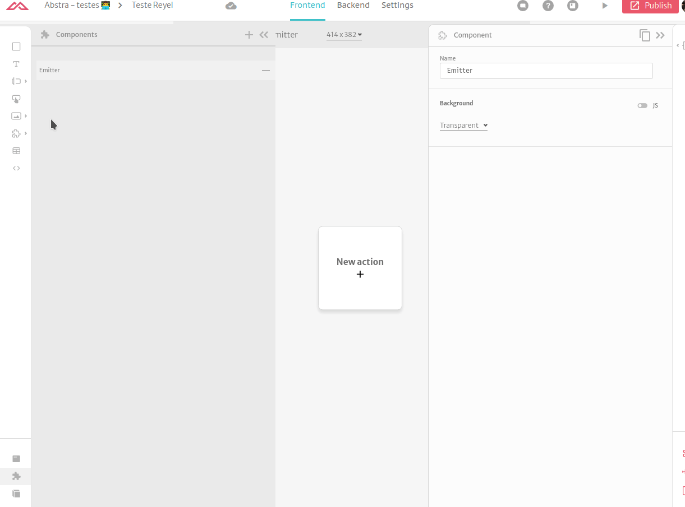

# Emit Event

When you have a component with custom internal behavior and you want to send information to the level above (the page which displays the component) you can emit events that can be captured and used to build more complex flows.

To do that you can add an action that dispatches the event

.png>)

On the component element on the page displaying the component you can add a trigger that catches the event so you can start an action flow

.png>)

To select which event you what to capture you can click on the trigger and edit the event filter

.png>)
