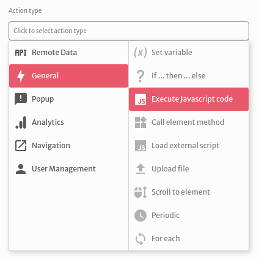
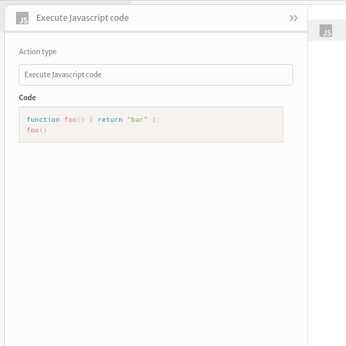
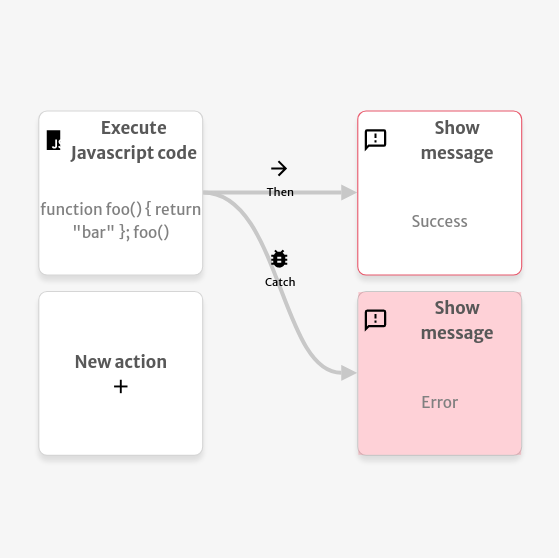

# Execute JavaScript code

The `Execute JavaScript code` action executes some custom JavaScript code. It lets you control the flow of your actions in case of success or in case an error is thrown.

You can type some JavaScript code to be evaluated in our code editor.

The example below shows the message `Success` when the code executes without any errors and shows the message `Error` when the code throws an error.

