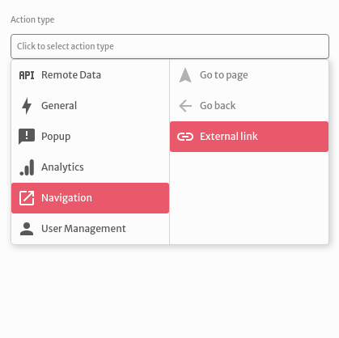
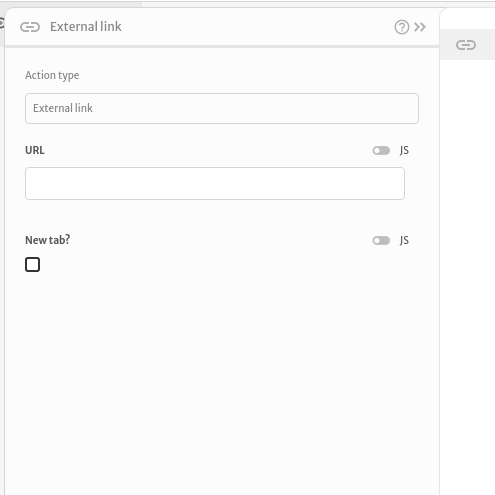
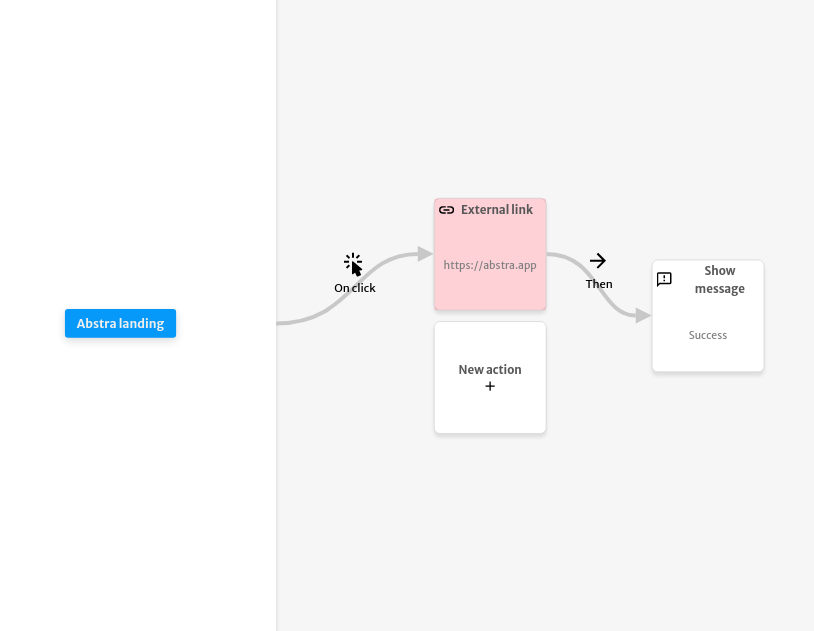

# External link

The `External link` action is used to redirect the user of your application to an external URL.

You can choose the `URL` to redirect your user to and if it should open on a `new tab`.

The example below redirects the user to the page [https://abstra.app](https://abstra.app) after clicking the `Abstra landing` button. After the redirect, it displays the `Success` message.

