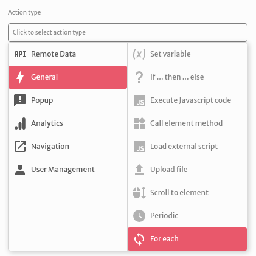
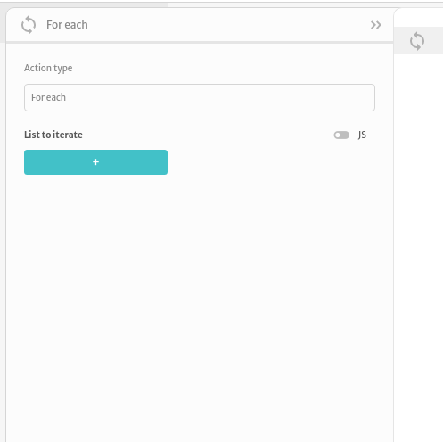
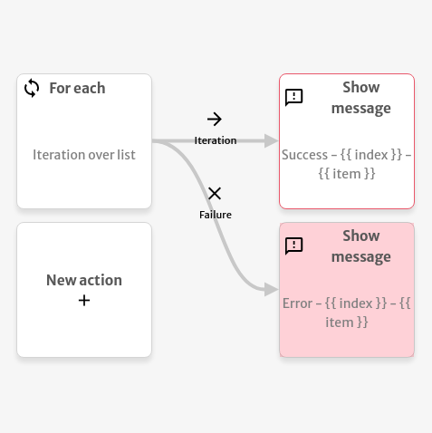

# For each

The `For each` action is used to fire another action for each item of a specified list.

You can choose a `List to iterate` that can be manually defined in the action or reference an existing variable toggling it's value to JS mode.

Every iteration or failure exposes an `item` and an `index` variable that can be used to do operations with other actions. The example below displays the message `Success` with the iteration `index` and `item` in case of a successful iteration and the message `Error` with the iteration `index` and `item` in case of a failed iteration. 

