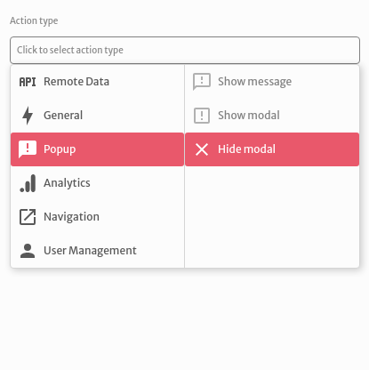
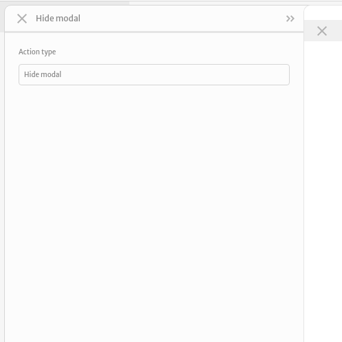
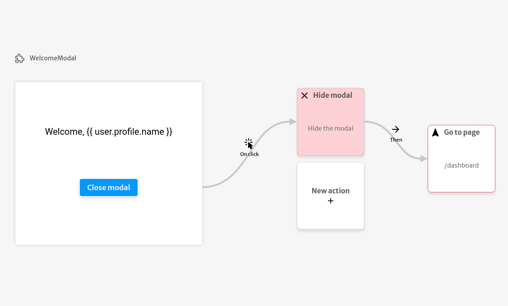

# Hide modal

The `Hide modal` action is used to hide the last modal opened by your application.

You don't need to configure any argument for this type of action.

The most common use case for this action is adding it to the on click trigger of a button inside your modal to close it.

The example below closes the `WelcomeModal` component after clicking on the `Close modal` button and then redirects the user to the `/dashboard` page.

