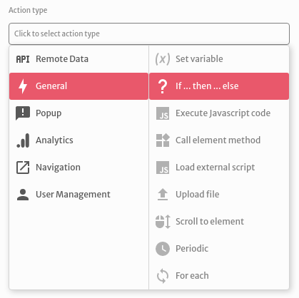
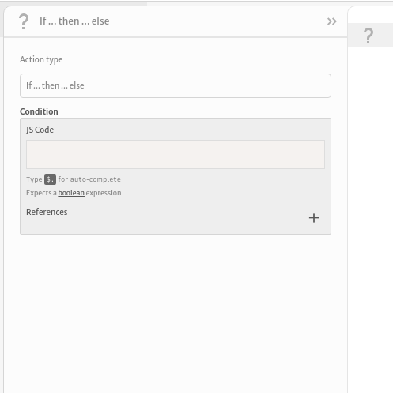

# If ... then ... else

The `If ... then ... else` action lets test a condition and control your application's action flow.

You can set a condition to be evaluated computing a custom JavaScript expression

Check the [Arguments section](https://docs.abstra.app/docs/front-end/arguments) for more details on how evaluating JavaScript expressions works.

