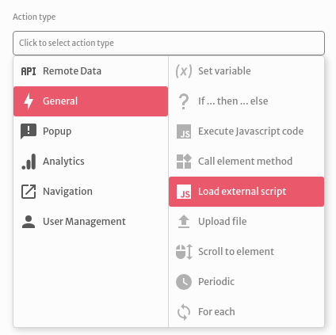
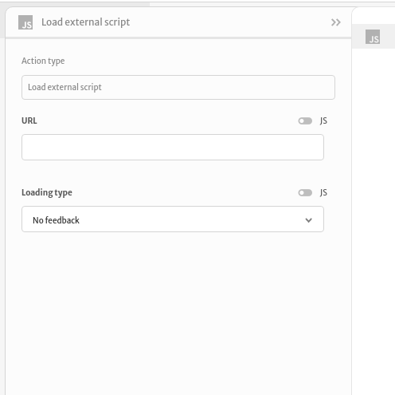
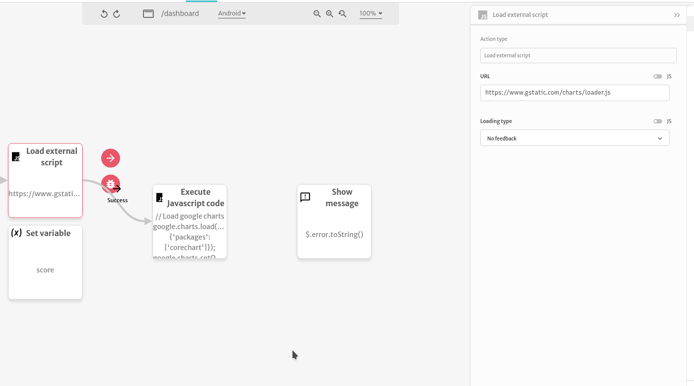

# Load external script

The `Load external script` action loads JavaScript code from a URL to your application. After loading, its lets you control the flow of your actions in case of success or in case an error is thrown.

You can setup its arguments choosing a `URL` to load the script from and a `Loading type` that can give no feedback to the users of your app or block them from doing anything until the script is loaded.

A common use case is loading the Google Charts library to create custom charts for your application. Example:

You can also use it to load a JS library like `lodash` and use it in your custom JS code snippets.

