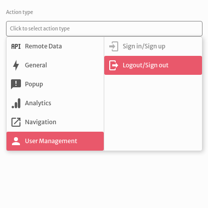
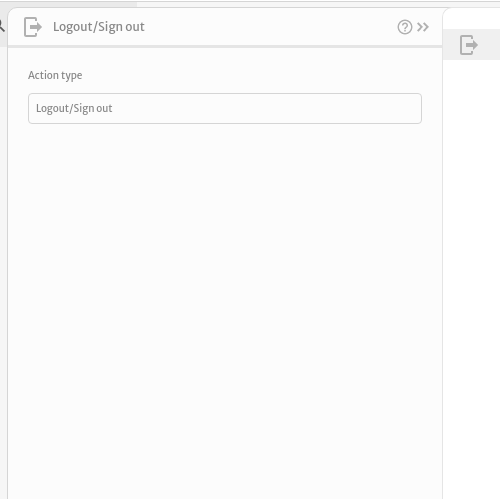
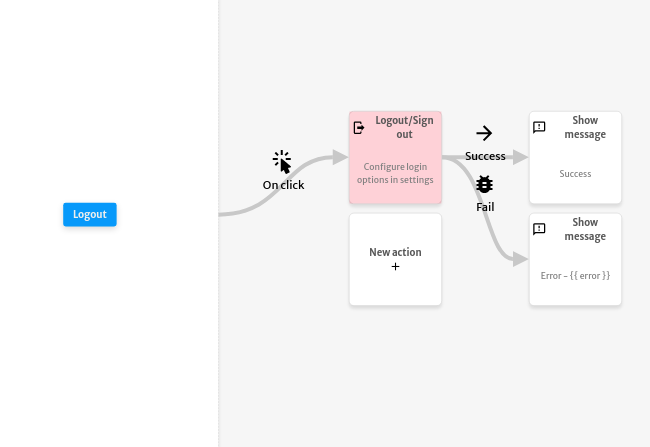

# Logout / Sign out

The `Logout / Sign out` action is used to logout the current user of your application.

You don't need to configure any argument for this action.

The example below signs out the the user after clicking the `Logout` button. In case of success, it displays the `Success` message. In case of an error, it displays the `Error` message with the `error` object thrown by the `Logout / Sign out` action.

