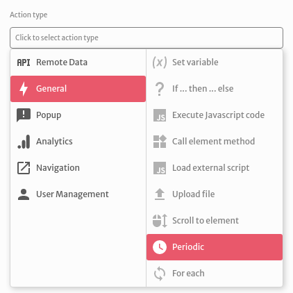
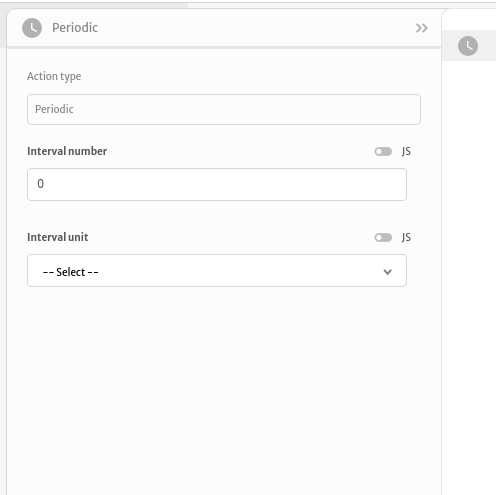
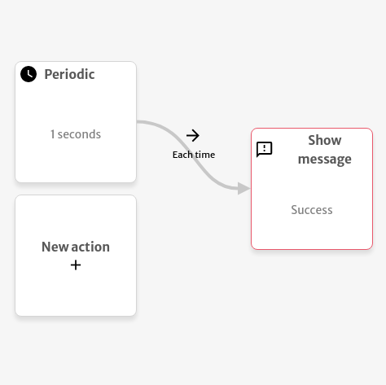

# Periodic

The `Periodic` action is used to fire another action repeatedly respecting a defined time interval.

You can setup its arguments choosing an `Interval number` and a `Interval unit`. Example: setting `1 minute` will repeat the next action every minute.

The example below shows the message `Success` every second.

