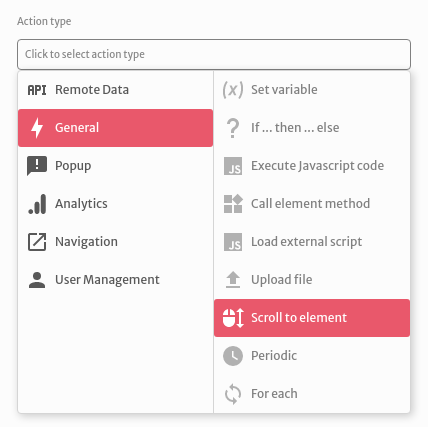
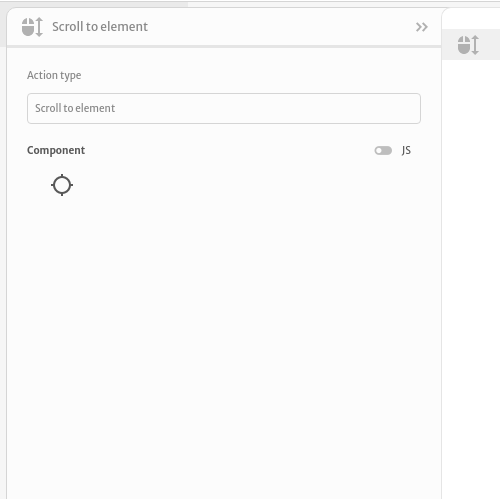
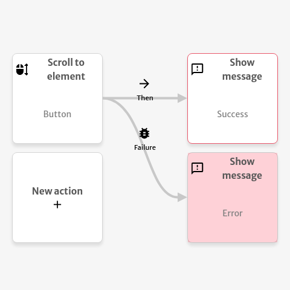

# Scroll to element

The `Scroll to element` action is used to scroll the users screen to a specific element on the page.

You are able to select which element you wish to scroll to.

You can trigger subsequent actions in case of success or error. The example below shows the message `Success` when the scroll action executes without any errors and shows the message `Error` when the scroll action throws an error.

