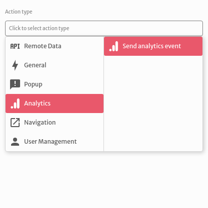
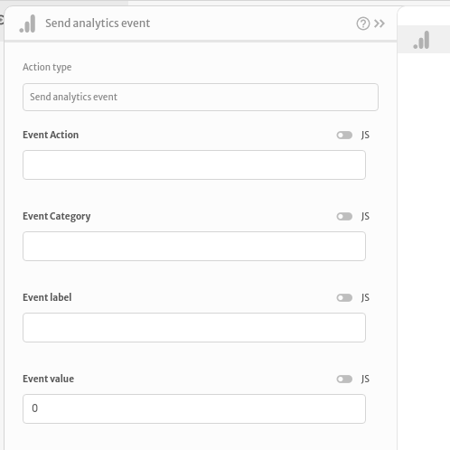
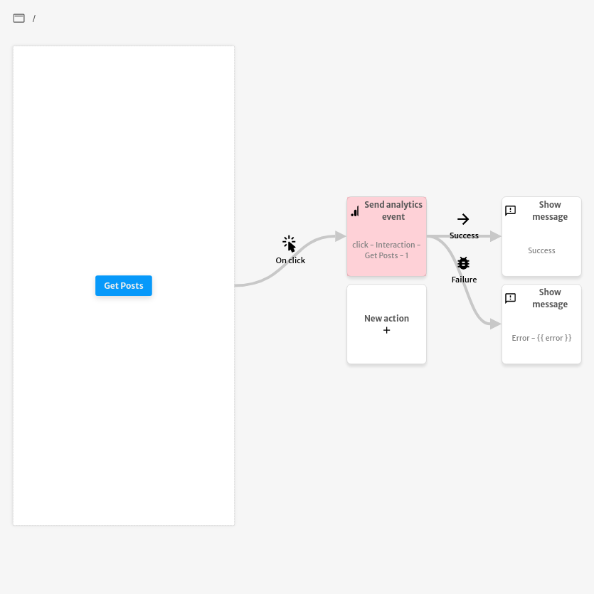

# Send analytics event

The `Send analytics event` action is used to dispatch your application's events to Google Analytics.

You can choose an `Event Action`, an `Event Category`, an `Event label` and an `Event value`.

The example below sends an analytics event after clicking on the `Get Posts` button. This event has the action `click`, the category `interaction`, the label `Get Posts` and the value `1`. In case of success, it displays the `Success` message. In case of an error, it displays the `Error` message with the `error` object thrown by the `Send analytics action`.

