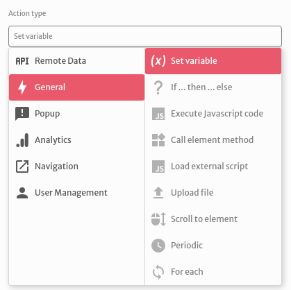
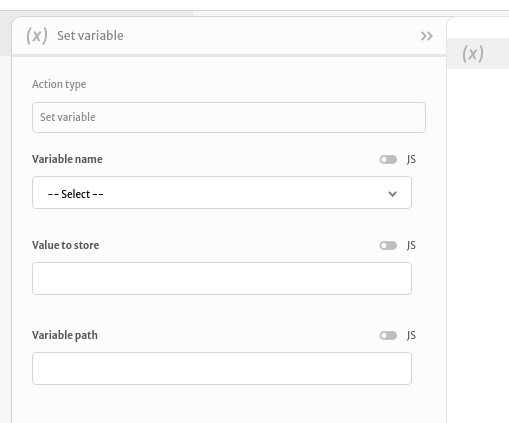
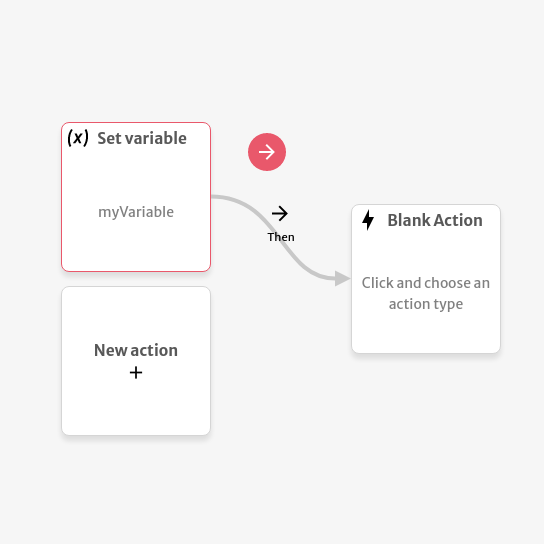
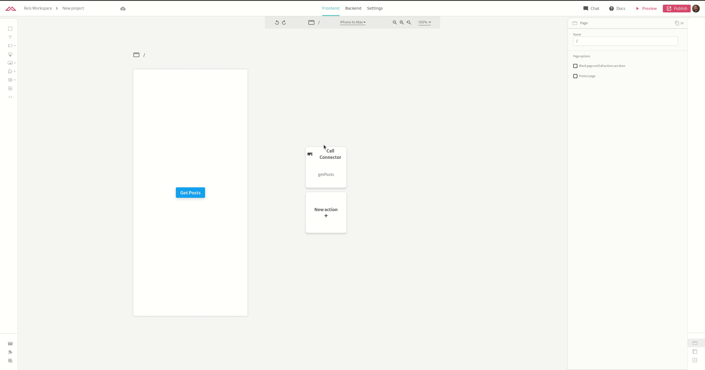

# Set variable

The `Set variable` action lets you set a variable value based on some interaction.

You can setup its arguments choosing a variable to bind the value to, an optional variable path and which value is being stored. 

The `Variable name` selector displays all local and global variables available and the `Variable path` lets you configure deeply nested values for structured variables. Check the [Variables section](https://docs.abstra.app/docs/front-end/variables) for more details. The `Value to store` lets you bind values using the mustache notation or executing some custom JavaScript code expression. Check the [Arguments section](https://docs.abstra.app/docs/front-end/arguments) for more details.

After successfully binding the value to your variable, you can execute any other action using it.

The example below shows how to set a variable based on a previous action and use it on a next:

