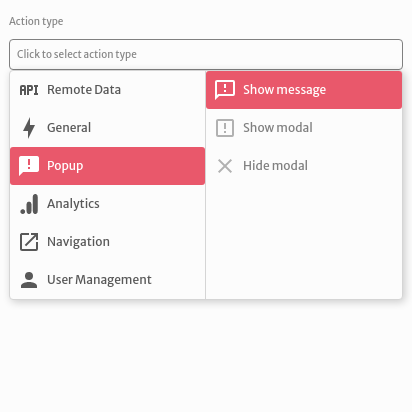
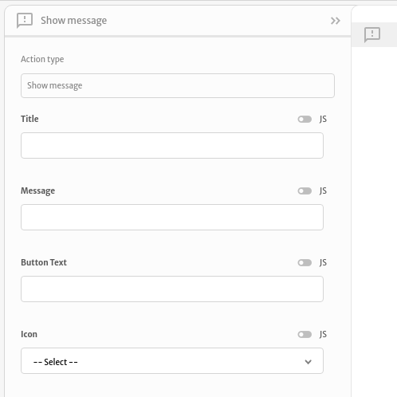
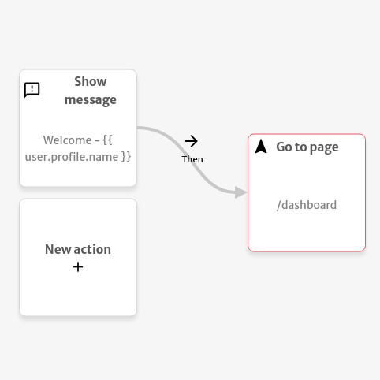

# Show message

The `Show message` action is used to display a message to the users of your application.

You can choose a `Title`,  a `Message`, a `Button Text` and an `Icon` to your message modal.

The example below shows the message with a title of "Welcome" and a message with the current user's name. After the user's confirmation, it redirects the user to the `/dashboard` page.

