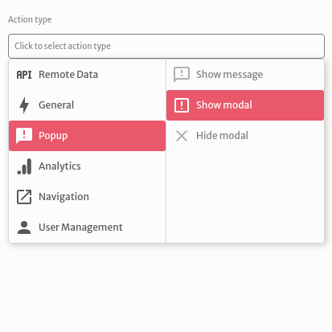
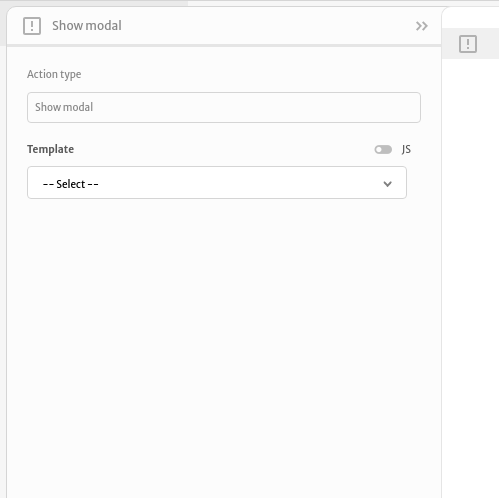
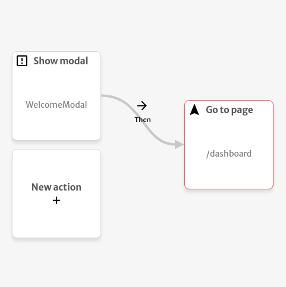

# Show modal

The `Show modal` action is used to display a modal to the users of your application.

You can choose a `Template`  to render inside your modal. A template can be an existing page or component of your application.

The example below shows the `WelcomeModal` component inside your modal and after being closed it redirects the user to the `/dashboard` page.

