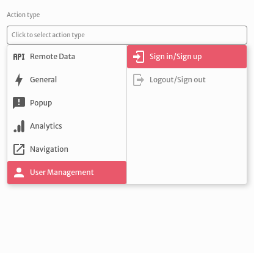
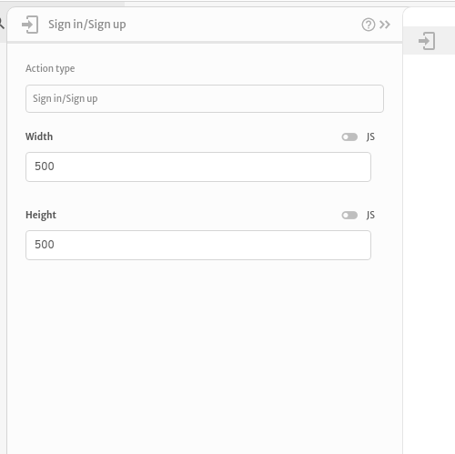

# Sign in / Sign up

The `Sign in / Sign up` action is used to sign in your application's users.

You can choose configure the size of the `Sign in / Sign up` modal that will show up when the action is triggered.

After the `Sign in / Sign up` action execution an `user.profile` and an `error` variables will be exposed and can be used to do operations with other actions. The example below displays the message `Success` with the `user.profile` in case of a successful execution and the message `Error` with the `error` in case of a failed execution of the `Sign in / Sign up` action. 

