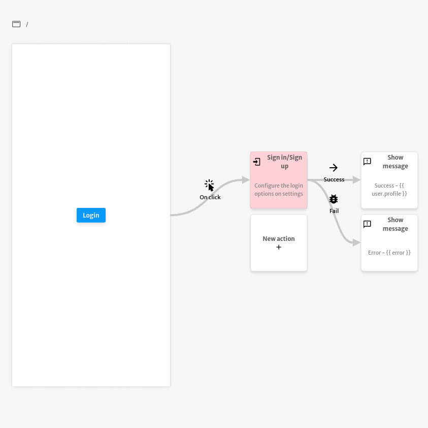

# Popup Sign in / Sign up

The `Popup Sign in / Sign up` action is used to sign in your application's users.

.png>)

You can configure the size of the login popup that will show up when the action is triggered.

.png>)

After the `Popup Sign in / Sign up` action execution the `user` and `error` variables will be exposed and can be used to do operations with other actions. The example below displays the message `Success` with the `user.profile` in case of a successful execution and the message `Error` with the `error` in case of a failed execution of the `Popup Sign in / Sign up` action.&#x20;

