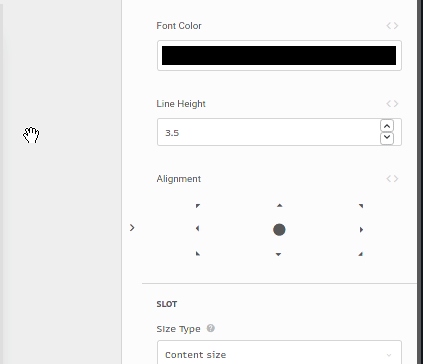

# Argument types

## text


### UI

Text input. This input parses [mustache notation](mustache-notation.md).

### Expression Mode

It's expected an expression that will be evaluated as a string.


Interpolation can be achieved using JavaScript template syntax.  
Example: if there is a context text variable called `name` and the expression is `My name is ${ $.name }`, on preview mode the variable value will replace it.


## richText


### UI

Rich text input.  
Selecting brings the rich text editor with options such as **bold**, _italic_ and `code`. Rich text shortcuts are also available.

### Expression Mode

It's expected an expression that can be evaluated as a string.  
For rich text formatting use HTML tags.

## number


### UI

Number input with up and down buttons.

### Expression Mode

It's expected an expression that can be evaluated as a number.

## boolean

TBP

## component

TBP

## componentId

TBP

## componentMethod

TBP

## variable

TBP

## code

TBP

## json

TBP

## js

TBP

## validator

TBP

## html

TBP

## css

TBP

## color



### UI

Color picker with hex values, opacity and default colors.

### Expression Mode

It's expected an expression that can be evaluated as a string representing [CSS colors](https://developer.mozilla.org/pt-BR/docs/Web/CSS/color_value).

## alignment


### UI

Alignment input. Default is `center`.

### Expression Mode

It's expected an expression that can be evaluated as one of the following strings:

* `top`
* `left`
* `right`
* `center`
* `bottom`
* `top-left`
* `top-right`
* `bottom-left`
* `bottom-right`

## background

TBP

## padding


### UI

Four number inputs for top, bottom, left and right paddings.  
Alongside the inputs there is a checkbox that unifies them in pairs

* `top + bottom`
* `left + right`
* `vertical + horizontal`

### Expression Mode

It's expected an expression that can be evaluated as an object containing the following properties \(the dimension property must be one of [CSS units](https://www.w3schools.com/cssref/css_units.asp)\):

```javascript
{
  "top": { "value": 8, "dimension": "px" },
  "bottom": { "value": 8, "dimension": "px" },
  "left": { "value": 16, "dimension": "px" },
  "right": { "value": 16, "dimension": "px" },
  "sameAll": false,
  "sameHorizontal": true,
  "sameVertical": true
}
```

## shadow


Shadow offsets for vertical and horizontal axis, spread, blur and color properties can be set.

### UI

Four number inputs for offset x , offset y, blur and spread and a color picker for the shadow color.

### Expression Mode

It's expected an expression that can be evaluated as an object containing the following properties \(the color property must be one of [CSS colors](https://developer.mozilla.org/pt-BR/docs/Web/CSS/color_value)\):

```javascript
{
  "x": 5,
  "y": 4,
  "color": "rgba(0, 0, 0, 0.15)",
  "blur": 3,
  "spread": 1
}
```

## border

Border properties: `width`, `color`, `style` and `radius`.  
All properties can be individually set for each side.

### UI

Two number inputs for border width and radius in pixels, one color picker for border color and one options input for border style \(available styles are none, solid, dashed and doted\).  
All inputs have a button alongside them that allows for individual setting of the property.

### Expression Mode

It's expected an expression that can be evaluated as an object with the following properties \(where the `style` property is one of `none`, `solid`, `dashed` or `dotted`\)

```javascript
{
  "width": 0,
  "style": "solid",
  "color": "rgba(0, 0, 0, 0.25)",
  "radius": 4
}
```

## template

TBP

## subview

TBP

## statementId

TBP

## columns

TBP

## options

It's expecter an array of objects with a `label` and a `value` property, eg:

```javascript
[
  {
    "label": "Option A",
    "value": 1
  },
  {
    "label": "Option B",
    "value": 2
  },{
    "label": "Option C",
    "value": 3
  }
]
```

The value of the input will be the `value` property of the selected option.

## query

It can be remote or local

Remote refers to connectors or SQL queries

### Expression Mode

When local, it allows any JS Array, eg:

```javascript
[ { "name": "John", "age": 45 }, { "name": "Anne", "age": 34 } ]
```

Also, it can be an object with the type

```javascript
{
    "remote": false,
    "data": [ HERE IS THE DATA HARDCODED ],
    "arguments": {}
}
```

When it is remote

## row

TBP

## route

TBP

## rowId

TBP

## tableId

TBP

## viewId

TBP

## expression

TBP

## image

Image file.

**UI**

Input direct URL for the image or upload the asset.

**Expression** Mode

It's expected an expression that can be evaluated as string containing the direct URL for the asset.

## graphql

TBP

