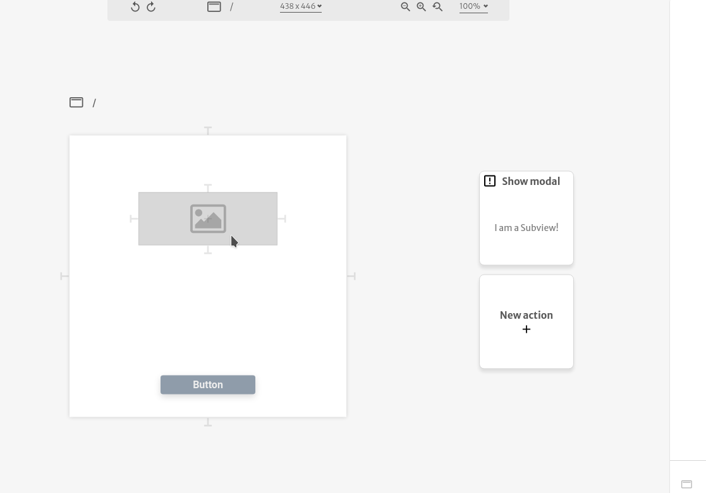

# Expression mode

All arguments have on their top-right corner a `JS` button which toggles it from the stock UI to a text area where user can write JavaScript code and complex logic.



As the name states, this field expects a JavaScript expression that will be evaluated as the argument value itself, so the value must fit the expected [argument types](argument-types.md) and range of values \(when applicable\).


**JavaScript Expressions** are any unit of code that can be evaluated to a value. Here is an interesting [article](https://medium.com/launch-school/javascript-expressions-and-statements-4d32ac9c0e74) about it.


For example if you set a text value argument of a [text element](../elements/text.md) with expression mode to 

```text
$.isLoading ? "Loading" : "Done!"
```

the evaluator will check the context object `$` for a `isLoading` [variable](../variables.md) to decide if its going display `Loading` or `Done!`. \(Yes, that is a ternary operator and they are very frequently used in expressions\)


There are several other use cases for expression modes, check them out in the section [common techniques](../../../tutorials/common-tecniques/).

