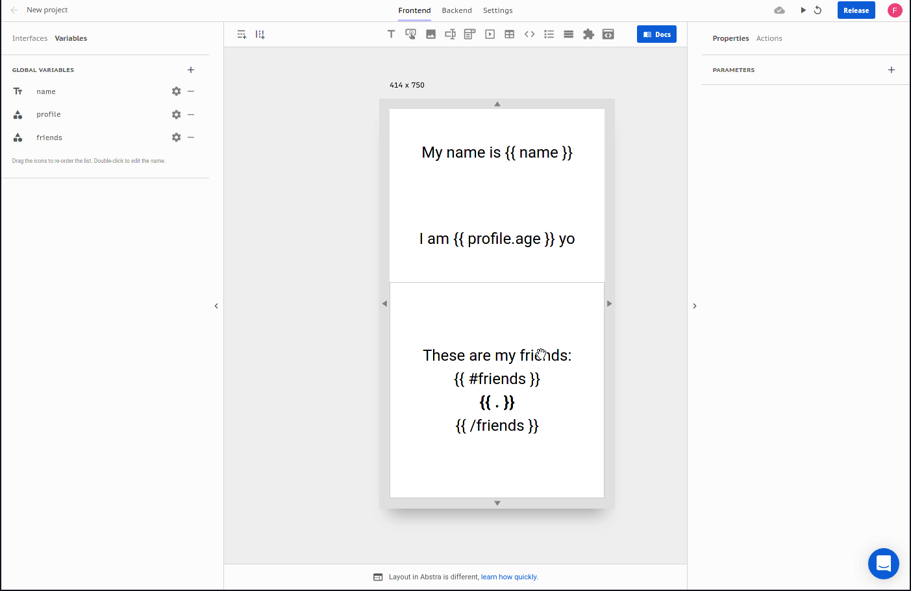

# Mustache notation

You can add dynamic values to all arguments that have a text input UI with mustache notation. Mustache notation is a template syntax that allows for logic-less templates.

For example:

* if you have a `name` text variable in the context and want to display a sentence with the name you can type:

```text
My name is {{ name }}
```

* if you have a profile object variable in the context with an age property and you want to display a sentence with the age you can type:

```text
I am {{ profile.age }} yo
```

* if you have a friends array variable in the context and you want to display a list with them you can type:

```text
These are my friends:
{{ #friends }}
{{ . })
{{ /friends }}
```

See the result:



For more on the mustache notation check [common techniques](../../../tutorials/common-tecniques/) or the [official documentation](https://github.com/janl/mustache.js).

