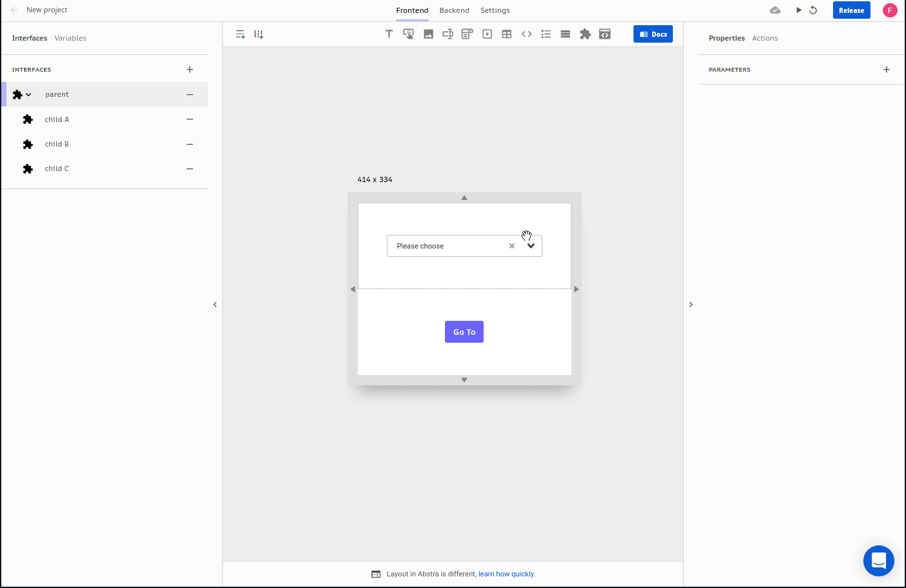

# References

When using expression mode you might stumble upon a difficult task: how to reference something other than [variables](https://docs.abstra.app/docs/front-end/variables), something that is not in the context?

For this task Abstra has a different approach: we use references. A reference is a "link" that points to another entity and exposes its properties and methods in a context-like variable accessible in expression mode.

You can reference four types of entities:

* Variables
* Components
* Tables
* Interfaces

For example:

In the `options` argument of a drop down component you can enter expression mode and create a reference `int` to a interface and use its `children` property to dynamically display them with the code:

```text
$.int.children.map(i => 
  ({
    label: i.name, 
    value: i.id
  })
)
```

Here how it works:



