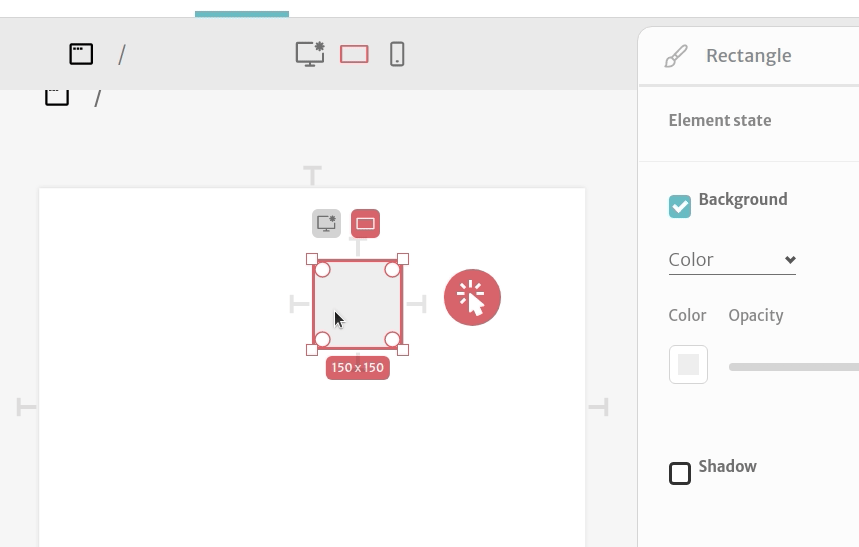
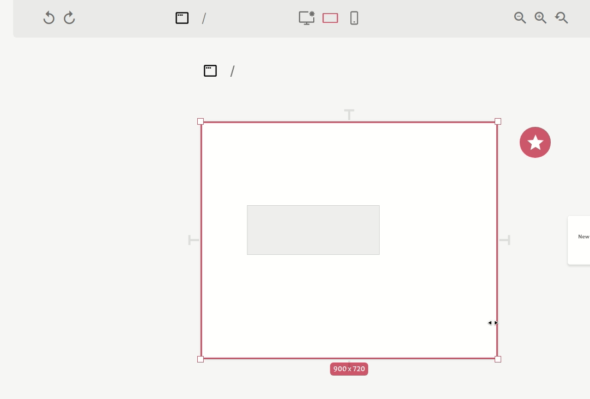
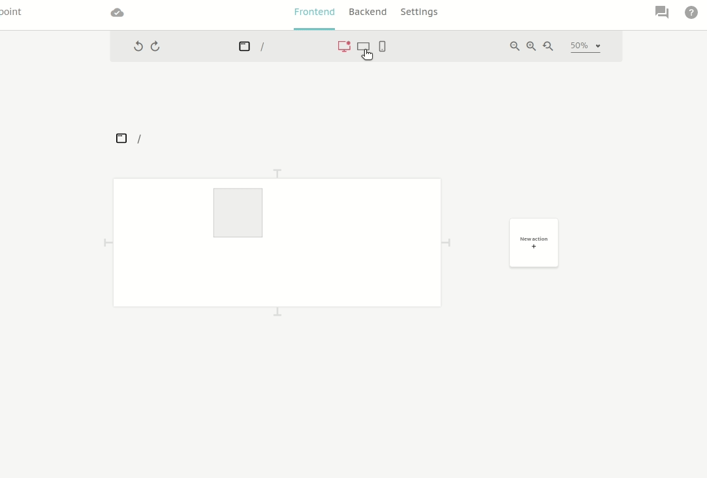

# Breakpoints

## Component Breakpoints

Every new page you make in Abstra have by default 3 breakpoints

.png>)

### Breakpoints inspector

These breakpoints can be edited by selecting the view and going to the breakpoint inspector on the right.

 (1) (1).png>)

In this section you can manage all your page breakpoints. Notice that you can change the breakpoint name by double-clicking its name.


If you are editing a project created before this feature, you probably won't see any pre-existing breakpoint.


## Element Breakpoints

Having breakpoints on the page doesnt make your elements behave differently on each screen. Every element can have multiple breakpoints as well and these breakpoints are what allows you to have distinct behaviors on different screen sizes.

You can add breakpoints on the element related to the breakpoint in the interface by pressing `Ctrl+B` or `right-click + add breakpoint`

 (1).png>)

The breakpoint attached to the element is related to the current active breakpoint on the view, which is the highlighted one.

Once you add a breakpoint in the element, you can change its position and this will affect only this breakpoint.

These breakpoints are active or not depending on the width of the component, which you can simulate by resizing the interface.


Notice that breakpoints only split geometry and visibility (x, y, width, height, hidden) properties. So any other property of the elements will be the same through multiple screen sizes.


## Springs and breakpoints

Every spring you use to position an element on the screen only affects one breakpoint at a time. That said, every breakpoint can have multiple rules of positioning and stretching.

