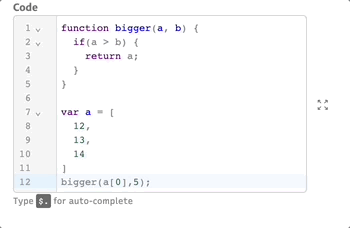
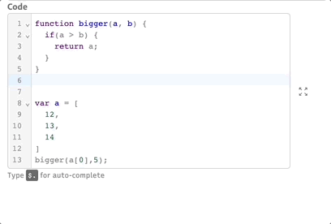
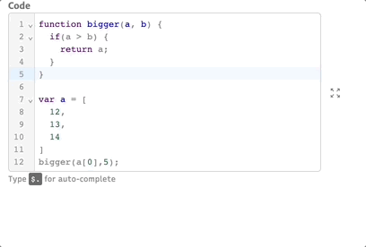
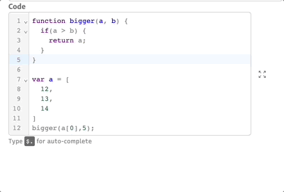
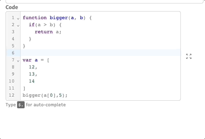
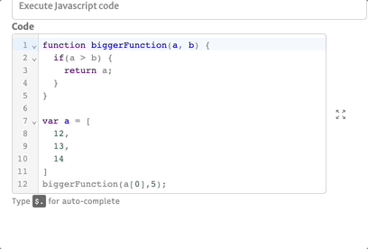
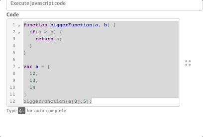
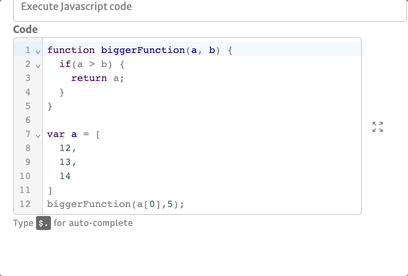

# Code Editor

Sometimes in Abstra you will utilize our code editor in order to do some advanced configurations (such as [execute js](actions/execute-javascript-code.md) and [expressions](arguments/expression-mode.md)) and, as usual, we got you covered with some hotkeys and quality of life features to help you writing down your code.

#### Code fold

With code fold you can hide some code snippets that you're not utilizing right now. It works with code wrapped on  `functions`,`if/else conditions` and `array declarations.`

#### Auto-Complete

Our code editor have some auto-completions to help you focus on what is important rather than have to remind simple syntax.

#### Commands

We have some commands at your disposal to ease your coding moments in Abstra.

* Ctrl-F (Cmd on macOS) to search inside the code.

* Ctrl-D (Cmd on macOS) to select the next similar group.

* Ctrl-ArrowLeft & Ctrl-ArrowRight (option on macOS) to move the cursor forward and backward a group. (Will select the group if shift is pressed).

.gif>)

* Ctrl-Backspace & Ctrl-Delete (option on macOS) to delete a group backward and forward.

* Ctrl-A (Cmd on macOS) to select all.

* Cmd-Delete (only on macOS): to delete to line start.

* option-ArrowUp & option-ArrowDown(only on macOS): To move the line up and down( duplicate line up with Shift)

