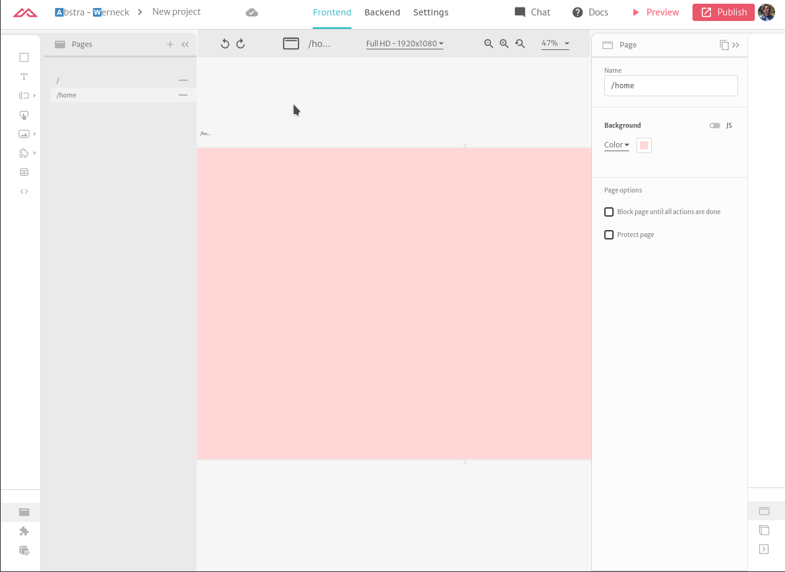
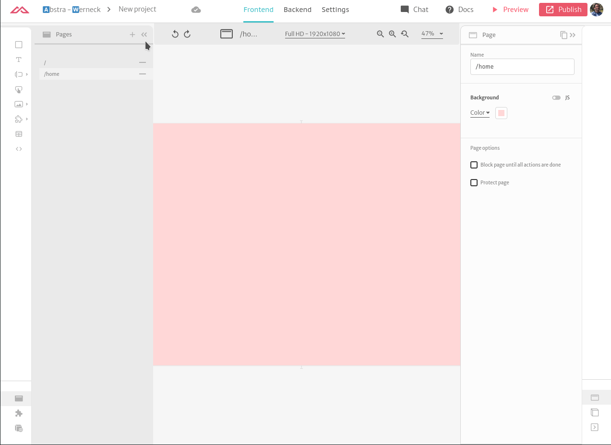

# Components

Components are building blocks you can use to make your application. It is used for mainly 3 reasons:

* Organizing a group of elements that have a similar purpose
* Creating a component that can be reused in multiple places \(e.g. a header\)
* Creating a component to be repeated in a collection

The components of your application are gathered in the components tab in the left sidebar. There you can create new components or select existing ones to edit.

Here you can see an example of a header component being added to a page using de _Reutilizable Component_ element.

