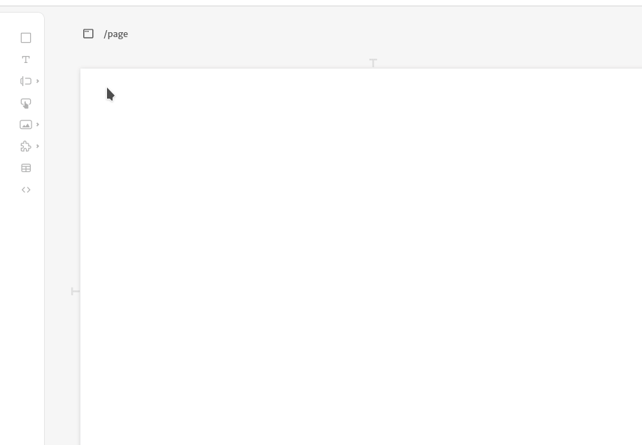
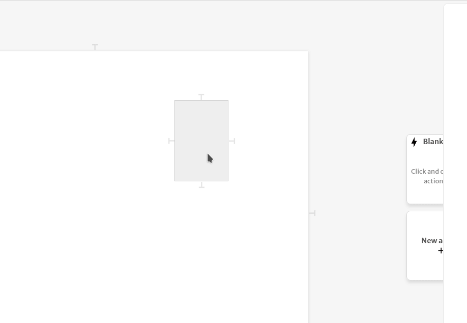
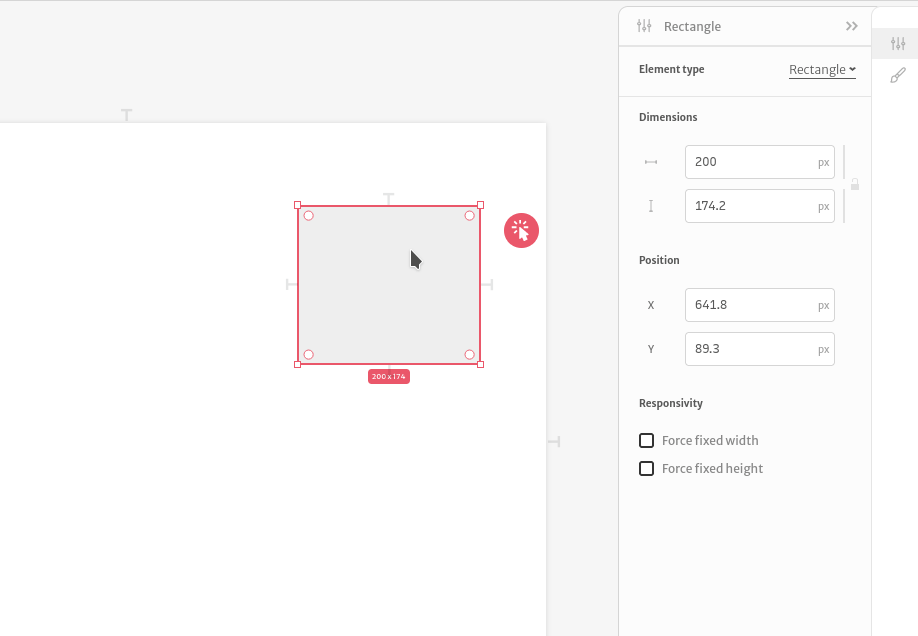

# Elements

Elements are the smallest pieces for you application. There are many different types of elements, that are used for various purposes, like inputs \(for getting information from the user\) and rectangles \(there are mainly visual elements\).

In order to put a new element on the screen, you simply select one from the left sidebar, then drag it to the canvas, as shown below:

You can alter an element's behavior by selecting it and changing its [arguments](../arguments/) on the right sidebar. Below, we show you how to change the color of a rectangle:

You can change the element's position and dimensions by dragging and stretching it, or by manually changing it on the sidebar. By clicking at the padlock you preserve the aspect ratio of your element while editing the dimensions at the sidebar.

You can check specific information about the elements in our Documentation!

