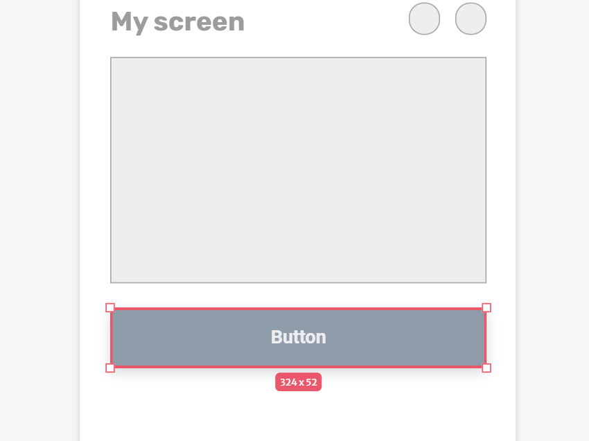
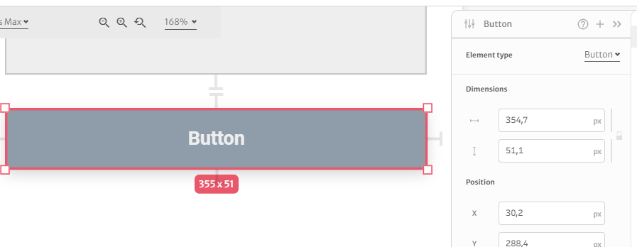

# Button

A simple clickable button where you can change the color, label, and other properties.

Like the rectangle, the button can be stretched to assume any dimensions. You can also edit its dimensions through the right sidebar

### Label

You can edit the text displayed on the button, and also change its properties like font size, font family, line height, color and hover color.

