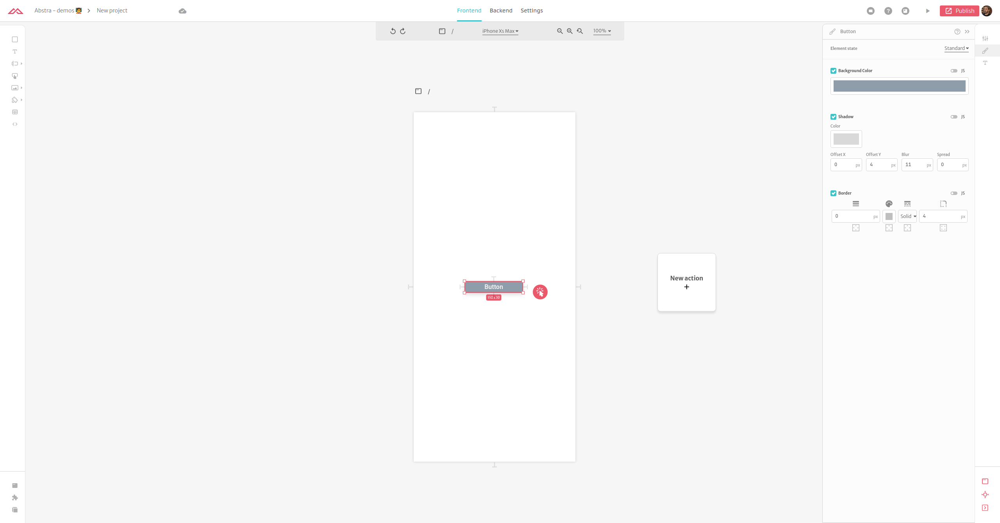
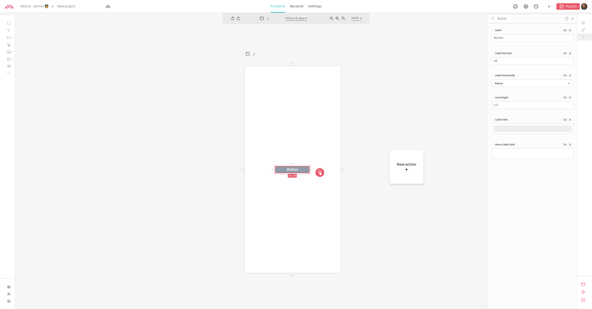

# Button

A simple clickable button element.

### Arguments

#### Label

Text that will be displayed inside the button.  
Format: [text](https://docs.abstra.app/docs/front-end/arguments/argument-types#text)  
Default: `Right click to add actions`

#### Background Color

Color of the button's box.  
Format: [color](https://docs.abstra.app/docs/front-end/arguments/argument-types#color)  
Default: `#6C63FF`

#### Hover Background Color

Color of the button's box when the cursor is hovering it.  
Format: [color](https://docs.abstra.app/docs/front-end/arguments/argument-types#color)  
Default: `#8E85FF`

#### Label Color

Color of text inside the button.  
Format: [color](https://docs.abstra.app/docs/front-end/arguments/argument-types#color)  
Default: `#EEEEEE`

#### Hover Label Color

Color of text inside the button when the cursor is hovering it.  
Format: [color](https://docs.abstra.app/docs/front-end/arguments/argument-types#color)  
Default: `#FFFFFF`

#### Label Font Size

Size of the font of text inside the button.  
Format: [number](https://docs.abstra.app/docs/front-end/arguments/argument-types#number)  
Default: `16`

#### Inner Padding

Spacing between the contents of the button and its border in pixels. Horizontal and vertical values only.  
Format: [padding](https://docs.abstra.app/docs/front-end/arguments/argument-types#padding)  
Default: horizontal `16px` and vertical `8px`

#### Shadow

Shadow of the button's box.  
Format: [shadow](https://docs.abstra.app/docs/front-end/arguments/argument-types#shadow)  
Default: `0` for vertical and horizontal offset, blur and spread properties. `rgba(0, 0, 0, 0.15)` for shadow color

#### Border

Border of the button's box.  
Format: [border](https://docs.abstra.app/docs/front-end/arguments/argument-types#border)  
Default \(for all sides\): `0px` for border width, `rgba(0, 0, 0, 0.25)` for border color, `solid` for border style and `4px` for border radius

#### Image

Icon that appears on the left side of the label inside the button's box.  
Format: [image](https://docs.abstra.app/docs/front-end/arguments/argument-types#image)

#### Font Style

Font families for the element. Options are [CSS font-family](https://www.w3schools.com/cssref/pr_font_font-family.asp) properties.

Format: discrete [text](https://docs.abstra.app/docs/front-end/arguments/argument-types#text)  
Default: "Roboto", sans-serif

#### Line Height

Line height as a multiplier, not pixels  
Format: [number](https://docs.abstra.app/docs/front-end/arguments/argument-types#number)  
Default: `1.5`

#### Tooltip

Text that appears when you place the mouse over the button  
Format: [text](https://docs.abstra.app/docs/front-end/arguments/argument-types#text)

#### Disabled

Is this button disabled?  
Format: [boolean](https://docs.abstra.app/docs/front-end/arguments/argument-types#boolean)  
Default: `false`

### Events

The following are the events triggered by this component:

#### On click

When this component is clicked, a `click` event is triggered and actions with this trigger will be initiated. No additional information is loaded on the context.

