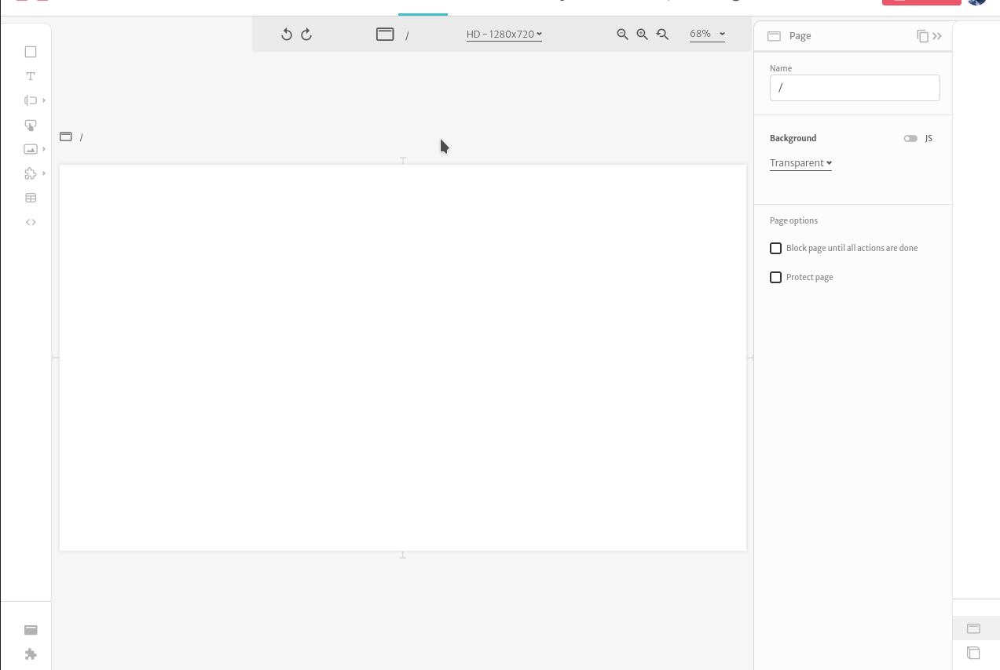
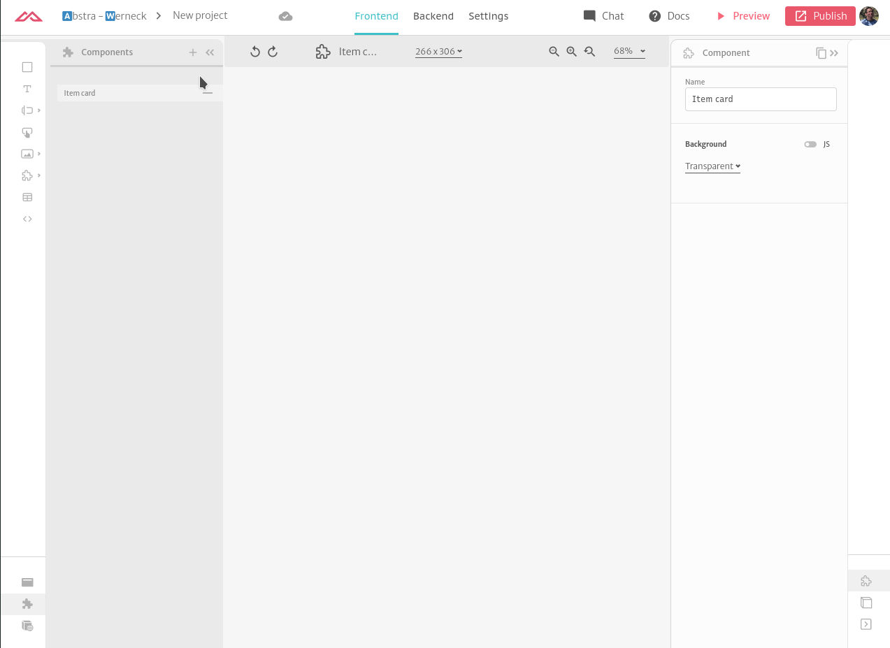
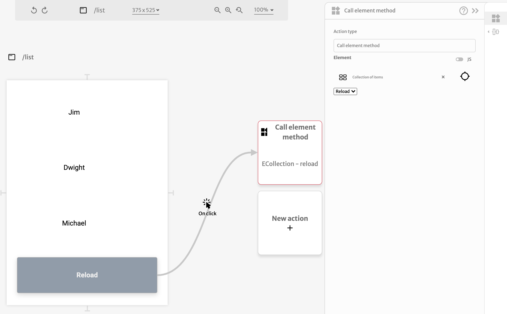

# Collection

The collection element is used to show a list of items using a component as base for the repetition. This can be used, for example, to display a list of products in an e-commerce, using a product card as repeated component.

The source for the items can be a regular _javascript_ list or the result of queries from the [_backend_](../../back-end/).

In the component, the value of the current item in the collection is available through the `item` property.

Collections have a method that reloads their data based on a trigger. Consider you have a collection and want to refetch it's data after clicking a button. You can bind a [Call Element Method](../actions/component-method.md) action to your button click event, select the collection and the `Reload` method.

### Arguments

#### Data source

Source of the array of items that will feed the collection  
Format: [query](../arguments/argument-types.md#query)

#### Display component

The component that will be repeated for the array of items  
Format: [subview](../arguments/argument-types.md#subview)

#### Empty fallback

The component that will be displayed when there is no element in the array of items  
Format: [subview](../arguments/argument-types.md#subview)

#### Error fallback

The component that will be displayed if there is an error when getting the array of items  
Format: [subview](../arguments/argument-types.md#subview)

#### Loading fallback

The component that will be displayed while the array of items is loaded  
Format: [subview](../arguments/argument-types.md#subview)

#### Direction

The direction the items will be placed in the collection. It can be either `vertical` or `horizontal`  
Format: [text](../arguments/argument-types.md#text)

#### Rows per scroll

How many rows of items will be necessary to fill the height of the collection  
Format: [number](../arguments/argument-types.md#number)

#### Columns per scroll

How many columns of items will be necessary to fill the width of the collection  
Format: [number](../arguments/argument-types.md#number)

#### Hide scroll bar?

Whether the scrollbar should be hidden \(the behaviour is kept the same, but visually there will be no scrollbar\)  
Format: [boolean](../arguments/argument-types.md#boolean)

#### Space between items

How much space should there be between the items of the collection  
Format: [number](../arguments/argument-types.md#number)

#### Inner padding

What should be the inner padding of the collection  
Format: [padding](../arguments/argument-types.md#padding)

