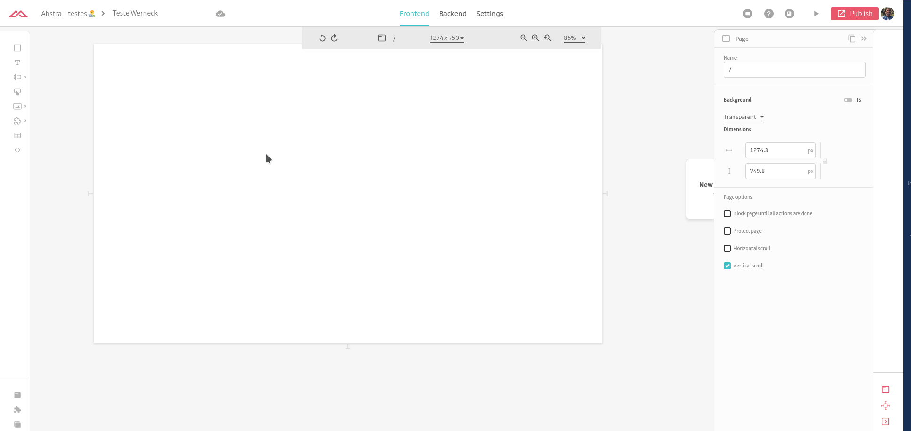
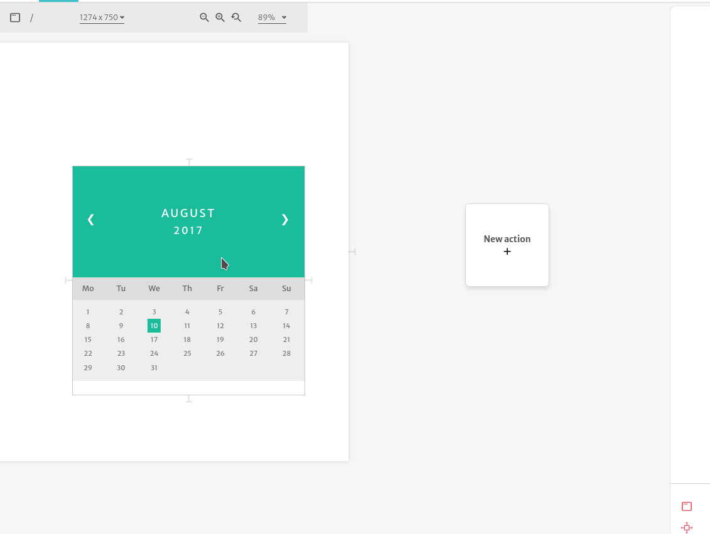

# HTML

When you have a complex layout that you wish to control better, you can use the HTML element. This element lets you write custom HTML and CSS content allowing for more customization of your application.

To configure this element, you simply input the HTML and CSS snippets in the correct places. A common use for this type of element is [creating charts](../../../tutorials/common-tecniques/adding-charts.md).

### Actions

The HTML elements supports the many different events emmited in the DOM. You can have actions listening to specific events by creating an action and changing the _event key_ property in the trigger, like this:

