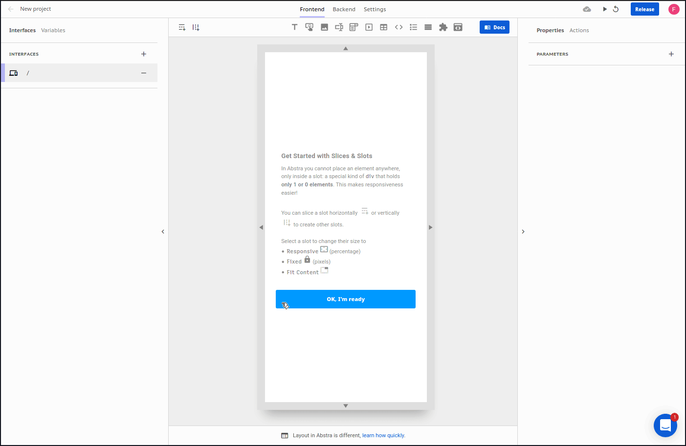

# Iframe

This component lets you render external pages with its embed URL

### Arguments

#### **Source**

Description: Iframe source URL\
Format: [text](https://docs.abstra.app/docs/front-end/arguments/argument-types#text)\
Default: Area 51 map in Google Maps&#x20;

#### **Allow full screen**

Description: Can this iframe be used in full screen?\
Format: [boolean](https://docs.abstra.app/docs/front-end/arguments/argument-types#boolean)\
Default: `false`

#### **Allow camera**

Description: Can this iframe request camera use?\
Format: [boolean](https://docs.abstra.app/docs/front-end/arguments/argument-types#boolean)\
Default: `false`

#### **Allow** microphone

Description: Can this iframe request microphone use?\
Format: [boolean](https://docs.abstra.app/docs/front-end/arguments/argument-types#boolean)\
Default: `false`

#### **Allow** diplay capture

Description: Can this iframe request display capture?\
Format: [boolean](https://docs.abstra.app/docs/front-end/arguments/argument-types#boolean)\
Default: `false`

### Events

The following are the events triggered by this component:

#### On **message**

When messages are sent by `postMessage`, a `message` event is triggered and actions with this trigger will be initiated. \
The message is injected on the event property on the context, accessible via `{{event}}` with mustache notation or `$.event` on expression mode.
