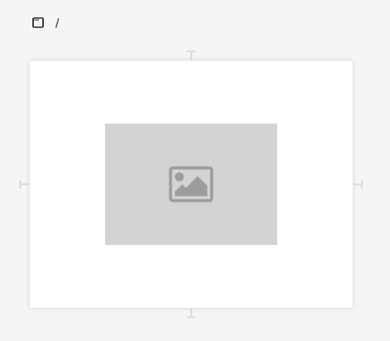
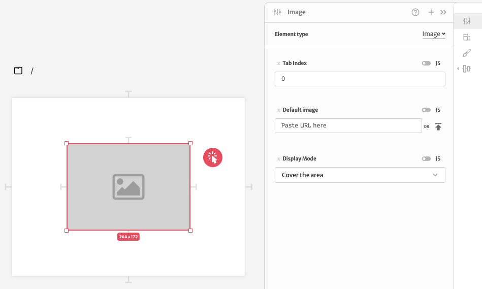
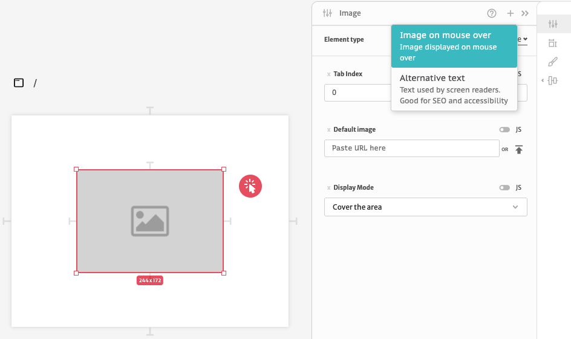
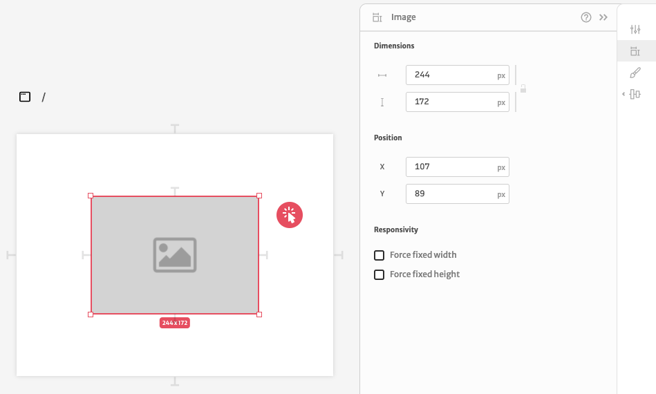
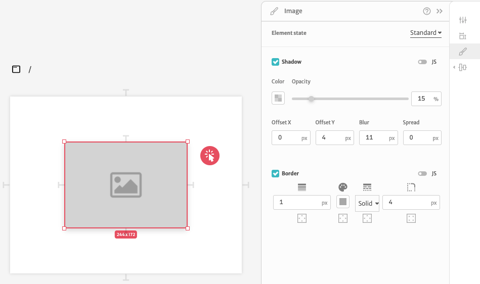

# Image

This element allows you to display images.

The image configuration is divided in 3 different sections. In the first section you can configure it's arguments.

The `Default image` argument let's you specify an URL for an image or upload a file from your computer. The `Display Mode` argument is used for specifying if the image should cover all the area of the rectangle or be contained inside it. `Tab Index` is used to configure how screen readers interact with your application. You can also add an `Alternative Text` argument for screen readers and an `Image on mouse over` argument to specify another image to be displayed on hover.

The second sections let's you configure it's dimensions, position, responsivity.

Since `Dimensions`, `Position` and `Responsivity` are common to all elements, you can checkout more about how they work [here](./). 

The  third configuration section let's you change your image styles. You can change it's `Shadow` and `Border`.

You can change the styles based on user interaction. They all have a `Standard` state configuration but you can change styles during `Hover` and `Click` interactions as well.

