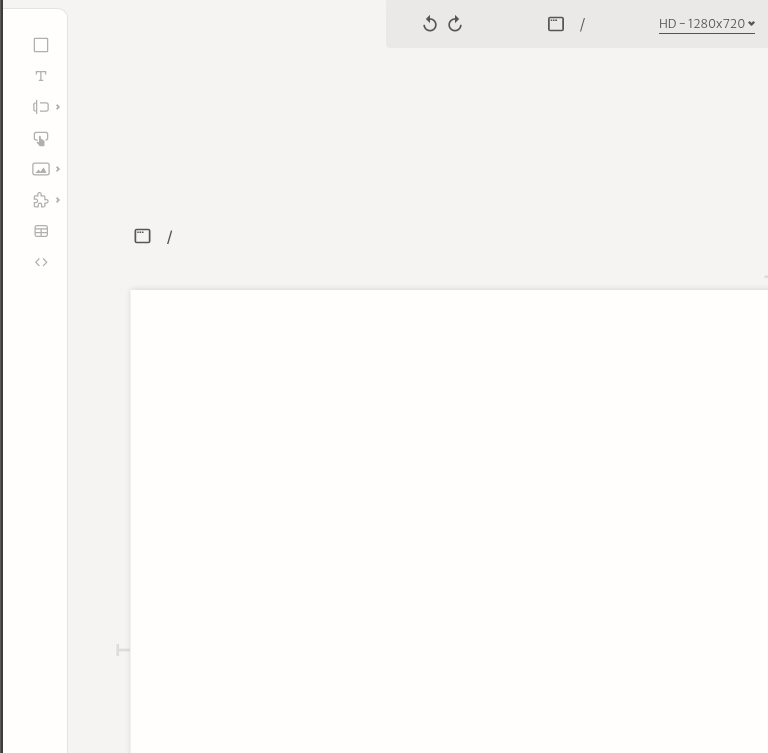

# Inputs

There are many types of input elements you can add to your application. Each one of them provide different custom features to improve your application's UX.

You are able to configure your inputs properties and style at the sidebar on the right side of the editor. All inputs have triggers that can be bound to actions when their values change. You can use this triggers to add interactivity to your application.

You can check specific information about each one of the input types at the following sections.

