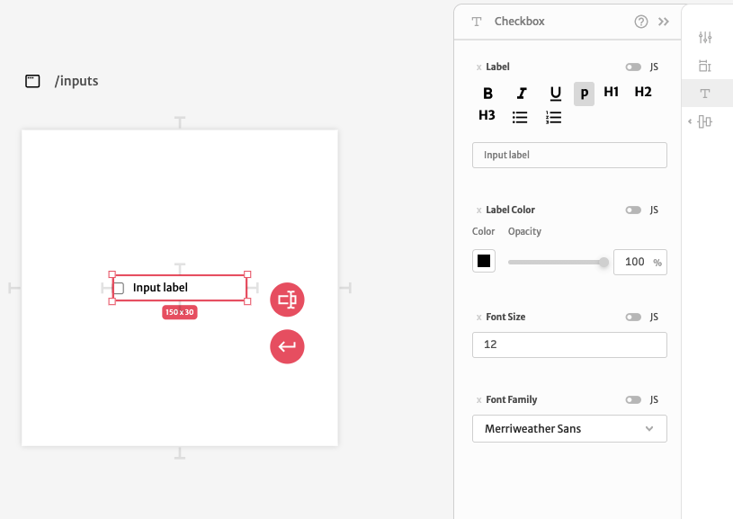

# Checkbox

Checkbox inputs are basic boolean inputs to define a value as `true` or `false`. They are commonly used when building forms.

A checkbox input configuration is divided in 3 different sections. In the first section you can configure it's arguments.

The `Variable` argument is useful for binding an input value to a variable of your application. If the variable is an object, you can add the `Variable Path` too. `Tab Index` is used to configure how screen readers interact with your application. You can also add a `Disabled` argument to specify a condition to disable this input.

The second sections let's you configure it's dimensions, position, responsivity.

Since `Dimensions`, `Position` and `Responsivity` are common to all elements, you can checkout more about how they work [here](../). 

The  third configuration section let's you change you input text settings. You can change it's `Label`, `Label Color`, `Font Size` and `Font Family`.

