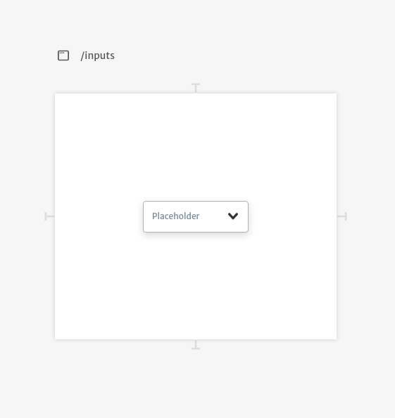
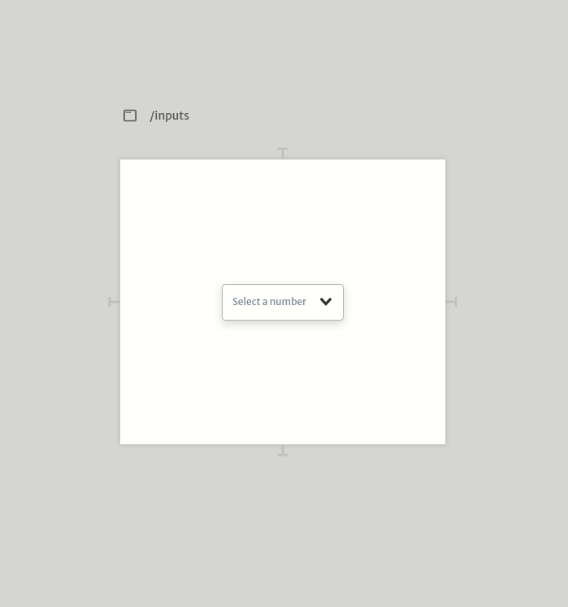
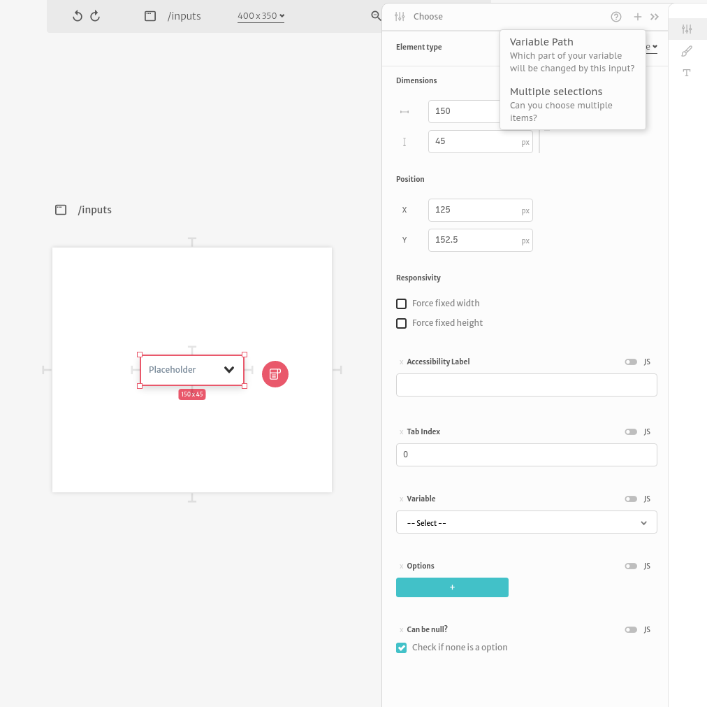
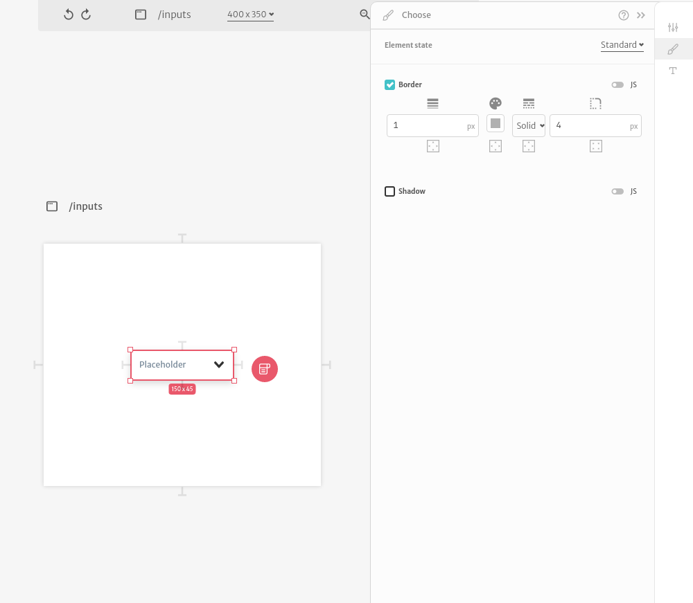
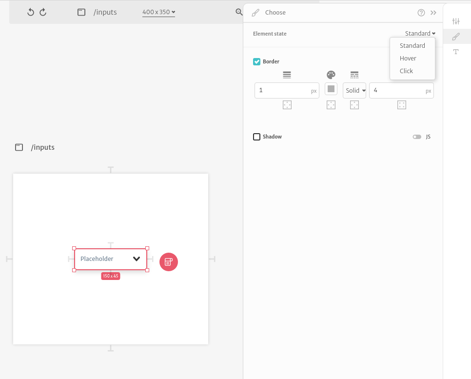
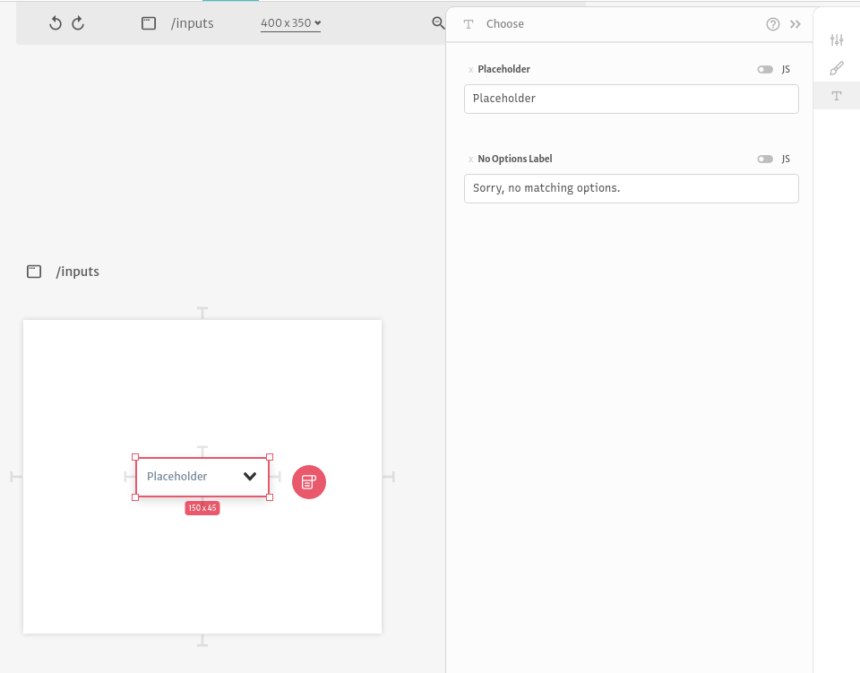

# Dropdown

Dropdown inputs are basic inputs for selecting an option, or a set of options, in a list of options. They are commonly used when building forms.

When users click at the input it reveals the options to select.

A dropdown input configuration is divided in 3 different sections. In the first section you can configure it's dimensions, position, responsivity and all of it's arguments.

Since `Dimensions`, `Position` and `Responsivity` are common to all elements, you can checkout more about how they work [here](../).

The `Variable` argument is useful for binding an input value to a variable of your application. If the variable is an object, you can add the `Variable Path` too. `Tab Index` and `Accessibility Label` are used to configure how screen readers interact with your application. You can also configure the `Options`, if the input accepts a null value or if it accepts multiple selections.

The  second configuration section let's you change you input styles. You can change it's `Shadow` and `Border`.

You can change the styles based on user interaction. They all have a `Standard` state configuration but you can change styles during `Hover` and `Click` interactions as well.

The  third configuration section let's you change you input `Placeholder` and `No Options Label`. Your users can type to filter the options, this label is displayed when no options match the typed value.

