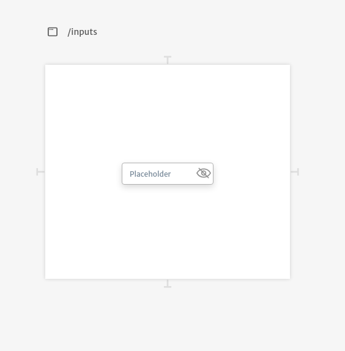
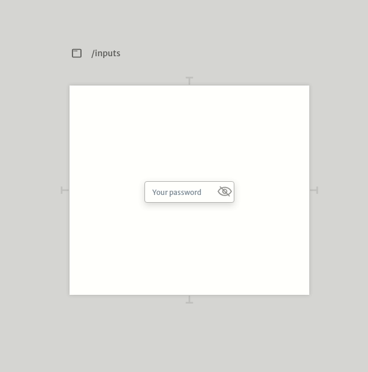
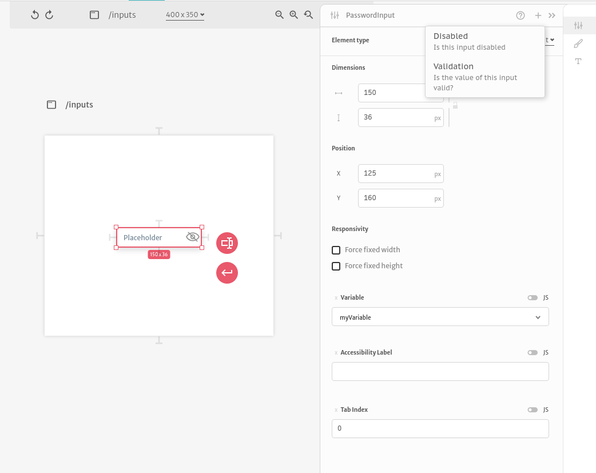

# Password

Password inputs are basic inputs for typing passwords in your application. They are commonly used when building forms.

When users click at the eye icon the password is revealed or hidden.

Their arguments are very similar to `Text Inputs` except for `Emoji Keyboards`. You can checkout how their arguments work reading the [Text Input documentation](../text.md).

