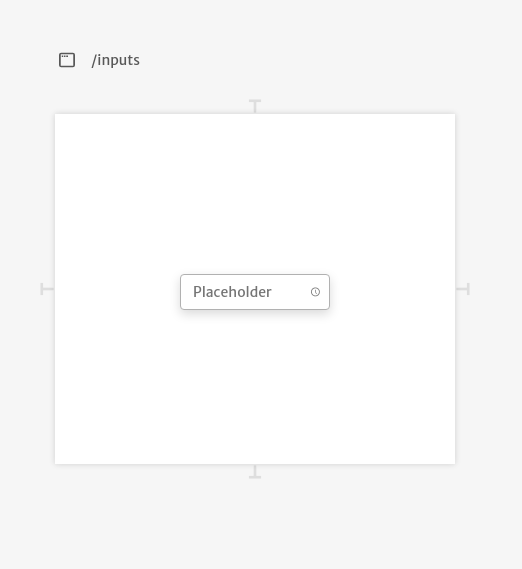

# Password

Password inputs are basic time selection inputs for your application. They are commonly used when building forms.

 Their arguments are very similar to `Text Inputs` except for `Accessibility Labels`, `Emoji Keyboards` and `Inner Padding`. You can checkout how their arguments work reading the [Text Input documentation](../text.md).

