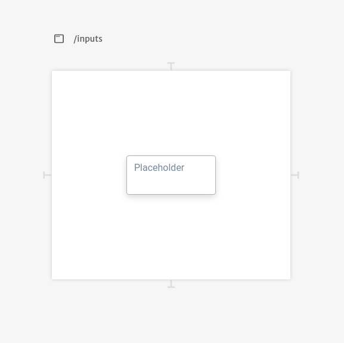

# Text Area

Text area inputs are basic single multiline text inputs for your application. They are commonly used when building forms.

Their arguments are the same as `Text Inputs`. You can checkout how their arguments work reading the [Text Input documentation](../text.md).

